# 🎛️ Audio Codec Leaderboard

[🎙️ Encoder Rankings](#encoder-leaderboard) | [🔊 Decoder Rankings](#decoder-leaderboard) | [📋 Encoder Breakdowns](#per-scenario-encoder-breakdowns) | [📋 Decoder Breakdowns](#per-scenario-decoder-breakdowns)

---

## 🎙️ Encoder Leaderboard

Quality scores are objective proxy estimates (Zimtohrli/ViSQOL), not blind ABX listening test results.

### Overall Encoder Rankings

> **Note**: Overall MOS averages the scenario set listed below, so absolute values are only comparable between leaderboards built from the same set of scenarios. Relative ranking is unaffected.

| Rank | Encoder | Status | Worst MOS | Overall MOS | Scenarios | Stereo Fidelity | Transient Fidelity | Speed (xRT) | Bitrate Error | Peak RAM | ROM (Flash) |
| :--- | :--- | :---: | :---: | :---: | :---: | :---: | :---: | :---: | :---: | :---: | :---: |
| 1 | FAAC 2.1.0 (2fbd9db-dirty) | OK | 0.000 | 0.000 | 33/33 | 0.9569 | 0.9109 | **117.0x** | 1.7% | 12.0 MB | 69.7 KB |
| 2 | FFmpeg AAC 6.1.1-3ubuntu5 | OK | 0.000 | 0.000 | 33/33 | 0.9679 | 0.8800 | 14.9x | 8.0% | 53.9 MB | 234.0 KB |
| 3 | fdkaac 1.0.0 | OK | 0.000 | 0.000 | 33/33 | **0.9860** | **0.9257** | 48.8x | **1.5%** | 12.0 MB | 558.1 KB |

<b>📊 View Per-Scenario Breakdowns & Visualizations</b>

## Per-Scenario Breakdown & Visualizations

### 16 kHz Mono Speech Quality Across Bitrates

<b>View Detailed 16 kHz Mono Speech Average & Worst MOS Tables</b>

#### Per-Scenario Average MOS (16 kHz Mono Speech)

#### Per-Scenario Worst MOS (Min Clip MOS - 16 kHz Mono Speech)

> **Note**: Minimum perceptual MOS score observed across any clip in the scenario. Highlights edge-case clip degradation. A 🐛 names the clip when every other encoder scored ≥0.75 MOS higher on that exact clip -- likely a defect specific to this encoder; see Quality Outliers under Issues Worth Investigating below.

### Transient Fidelity (16 kHz Mono Speech)

> **Note**: Measured as 1 / (1 + mean |attack-centroid-shift| ms) across onsets. **Higher is truer** (attack timing closer to reference).

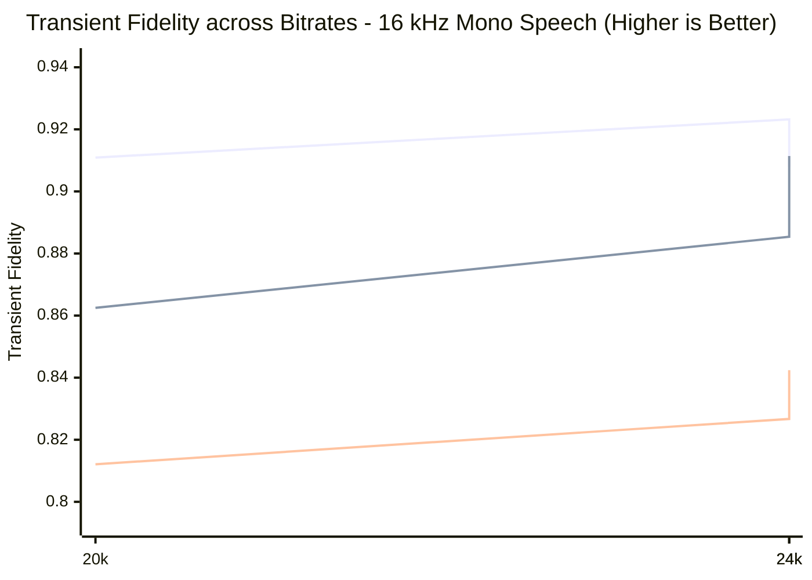
```mermaid
xychart-beta
    title "Transient Fidelity across Bitrates - 16 kHz Mono Speech (Higher is Better)"
    x-axis ["20k", "24k", "24k"]
    y-axis "Transient Fidelity" 0.7921 --> 0.9432
    line "FAAC 2.1.0 (2fbd9db-dirty) (LC)" [0.9109, 0.9232, 0.9079]
    line "fdkaac 1.0.0 (LC)" [0.8625, 0.8854, 0.9114]
    line "FFmpeg AAC 6.1.1-3ubuntu5 (LC)" [0.8121, 0.8267, 0.8424]
```

<b>View Detailed Transient Fidelity Table (16 kHz Mono Speech)</b>

#### LC Profile

| Scenario | FAAC 2.1.0 (2fbd9db-dirty) | fdkaac 1.0.0 | FFmpeg AAC 6.1.1-3ubuntu5 |
| :--- | :---: | :---: | :---: |
| 16k_mono_20k | **0.9109** ███████░ | 0.8625 ███████░ | 0.8121 ██████░░ |
| 16k_mono_24k | **0.9232** ███████░ | 0.8854 ███████░ | 0.8267 ███████░ |
| 16k_mono_voip_24k | 0.9079 ███████░ | **0.9114** ███████░ | 0.8424 ███████░ |

### Bitrate Accuracy (16 kHz Mono Speech)

> **Note**: Deviation from target bitrate calculated from pure elementary stream audio bytes. **Lower is Better**.

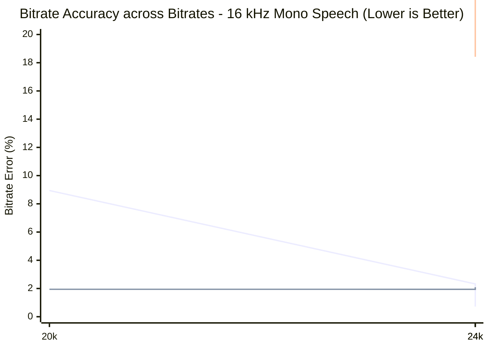
```mermaid
xychart-beta
    title "Bitrate Accuracy across Bitrates - 16 kHz Mono Speech (Lower is Better)"
    x-axis ["20k", "24k", "24k"]
    y-axis "Bitrate Error (%)" 0 --> 20
    line "FAAC 2.1.0 (2fbd9db-dirty) (LC)" [8.9430, 2.3243, 0.7164]
    line "fdkaac 1.0.0 (LC)" [1.9447, 1.9439, 2.0925]
    line "FFmpeg AAC 6.1.1-3ubuntu5 (LC)" [30.1551, 32.4666, 18.4215]
```

<b>View Detailed Bitrate Accuracy Table (16 kHz Mono Speech)</b>

#### LC Profile

| Scenario | FAAC 2.1.0 (2fbd9db-dirty) | fdkaac 1.0.0 | FFmpeg AAC 6.1.1-3ubuntu5 |
| :--- | :---: | :---: | :---: |
| 16k_mono_20k | 8.9% | **1.9%** | 30.2% |
| 16k_mono_24k | 2.3% | **1.9%** | 32.5% |
| 16k_mono_voip_24k | **0.7%** | 2.1% | 18.4% |

### 24 kHz Mono Speech Quality Across Bitrates

<b>View Detailed 24 kHz Mono Speech Average & Worst MOS Tables</b>

#### Per-Scenario Average MOS (24 kHz Mono Speech)

#### Per-Scenario Worst MOS (Min Clip MOS - 24 kHz Mono Speech)

> **Note**: Minimum perceptual MOS score observed across any clip in the scenario. Highlights edge-case clip degradation. A 🐛 names the clip when every other encoder scored ≥0.75 MOS higher on that exact clip -- likely a defect specific to this encoder; see Quality Outliers under Issues Worth Investigating below.

### Transient Fidelity (24 kHz Mono Speech)

> **Note**: Measured as 1 / (1 + mean |attack-centroid-shift| ms) across onsets. **Higher is truer** (attack timing closer to reference).

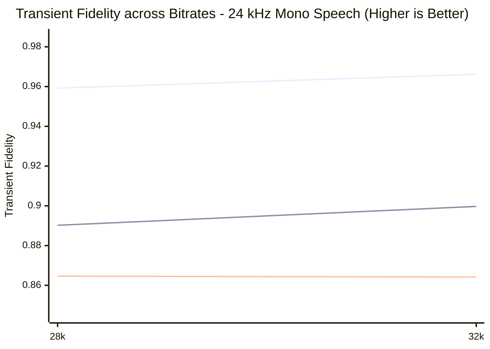
```mermaid
xychart-beta
    title "Transient Fidelity across Bitrates - 24 kHz Mono Speech (Higher is Better)"
    x-axis ["28k", "32k"]
    y-axis "Transient Fidelity" 0.8442 --> 0.9862
    line "FAAC 2.1.0 (2fbd9db-dirty) (LC)" [0.9592, 0.9662]
    line "fdkaac 1.0.0 (LC)" [0.8902, 0.8997]
    line "FFmpeg AAC 6.1.1-3ubuntu5 (LC)" [0.8646, 0.8642]
```

<b>View Detailed Transient Fidelity Table (24 kHz Mono Speech)</b>

#### LC Profile

| Scenario | FAAC 2.1.0 (2fbd9db-dirty) | fdkaac 1.0.0 | FFmpeg AAC 6.1.1-3ubuntu5 |
| :--- | :---: | :---: | :---: |
| 24k_mono_28k | **0.9592** ████████ | 0.8902 ███████░ | 0.8646 ███████░ |
| 24k_mono_32k | **0.9662** ████████ | 0.8997 ███████░ | 0.8642 ███████░ |

### Bitrate Accuracy (24 kHz Mono Speech)

> **Note**: Deviation from target bitrate calculated from pure elementary stream audio bytes. **Lower is Better**.

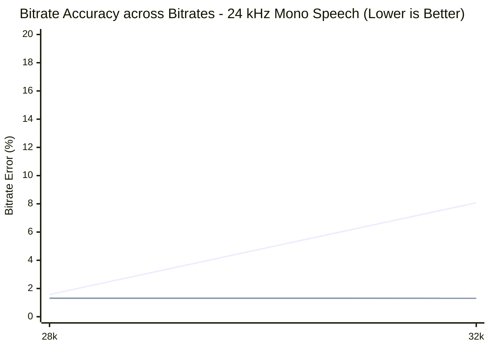
```mermaid
xychart-beta
    title "Bitrate Accuracy across Bitrates - 24 kHz Mono Speech (Lower is Better)"
    x-axis ["28k", "32k"]
    y-axis "Bitrate Error (%)" 0 --> 20
    line "FAAC 2.1.0 (2fbd9db-dirty) (LC)" [1.5743, 8.0736]
    line "fdkaac 1.0.0 (LC)" [1.3100, 1.3079]
    line "FFmpeg AAC 6.1.1-3ubuntu5 (LC)" [32.9586, 33.0269]
```

<b>View Detailed Bitrate Accuracy Table (24 kHz Mono Speech)</b>

#### LC Profile

| Scenario | FAAC 2.1.0 (2fbd9db-dirty) | fdkaac 1.0.0 | FFmpeg AAC 6.1.1-3ubuntu5 |
| :--- | :---: | :---: | :---: |
| 24k_mono_28k | 1.6% | **1.3%** | 33.0% |
| 24k_mono_32k | 8.1% | **1.3%** | 33.0% |

### 32 kHz Stereo Quality Across Bitrates

<b>View Detailed 32 kHz Stereo Average & Worst MOS Tables</b>

#### Per-Scenario Average MOS (32 kHz Stereo)

#### Per-Scenario Worst MOS (Min Clip MOS - 32 kHz Stereo)

> **Note**: Minimum perceptual MOS score observed across any clip in the scenario. Highlights edge-case clip degradation. A 🐛 names the clip when every other encoder scored ≥0.75 MOS higher on that exact clip -- likely a defect specific to this encoder; see Quality Outliers under Issues Worth Investigating below.

### Stereo Image Fidelity (32 kHz Stereo)

> **Note**: Measured as 1.0 - |Coherence(Ref) - Coherence(Deg)|. **Higher is truer** (closer to reference stereo image).

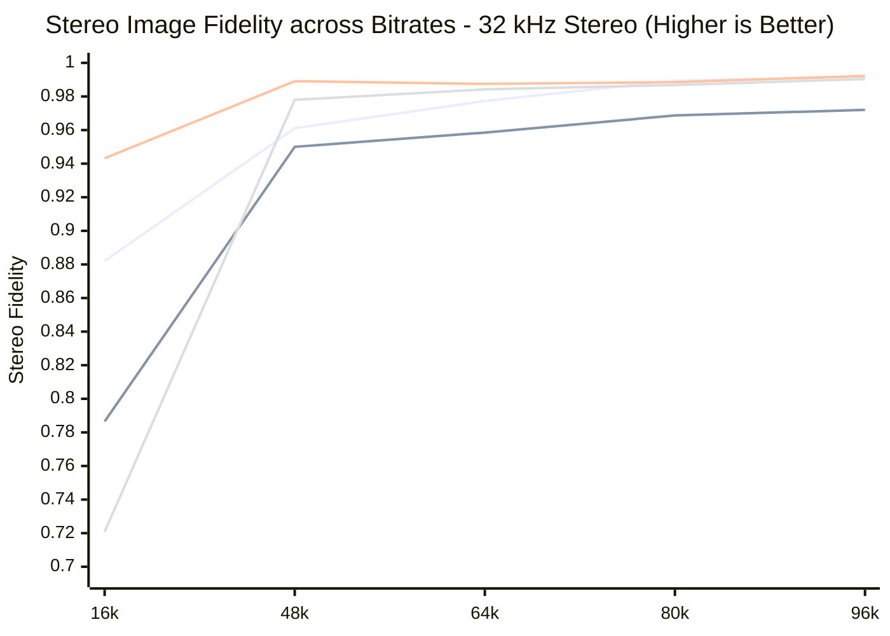
```mermaid
xychart-beta
    title "Stereo Image Fidelity across Bitrates - 32 kHz Stereo (Higher is Better)"
    x-axis ["16k", "48k", "64k", "80k", "96k"]
    y-axis "Stereo Fidelity" 0.6938 --> 1
    line "FAAC 2.1.0 (2fbd9db-dirty) (HE)" [0.8820, 0.9611, 0.9773, 0.9894, 0.9921]
    line "FAAC 2.1.0 (2fbd9db-dirty) (LC)" [0.7865, 0.9500, 0.9585, 0.9687, 0.9720]
    line "fdkaac 1.0.0 (LC)" [0.9432, 0.9891, 0.9875, 0.9885, 0.9922]
    line "FFmpeg AAC 6.1.1-3ubuntu5 (LC)" [0.7209, 0.9780, 0.9842, 0.9868, 0.9904]
```

<b>View Detailed Stereo Fidelity Table (32 kHz Stereo)</b>

#### LC Profile

| Scenario | FAAC 2.1.0 (2fbd9db-dirty) | fdkaac 1.0.0 | FFmpeg AAC 6.1.1-3ubuntu5 |
| :--- | :---: | :---: | :---: |
| 32k_stereo_16k | 0.7865 ██████░░ | **0.9432** ████████ | 0.7209 ██████░░ |
| 32k_stereo_48k | 0.9500 ████████ | **0.9891** ████████ | 0.9780 ████████ |
| 32k_stereo_64k | 0.9585 ████████ | **0.9875** ████████ | 0.9842 ████████ |
| 32k_stereo_80k | 0.9687 ████████ | **0.9885** ████████ | 0.9868 ████████ |
| 32k_stereo_96k | 0.9720 ████████ | **0.9922** ████████ | 0.9904 ████████ |

#### HE-v1 Profile

| Scenario | FAAC 2.1.0 (2fbd9db-dirty) |
| :--- | :---: |
| 32k_stereo_16k | **0.8820** ███████░ |
| 32k_stereo_48k | **0.9611** ████████ |
| 32k_stereo_64k | **0.9773** ████████ |
| 32k_stereo_80k | **0.9894** ████████ |
| 32k_stereo_96k | **0.9921** ████████ |

### Transient Fidelity (32 kHz Stereo)

> **Note**: Measured as 1 / (1 + mean |attack-centroid-shift| ms) across onsets. **Higher is truer** (attack timing closer to reference).

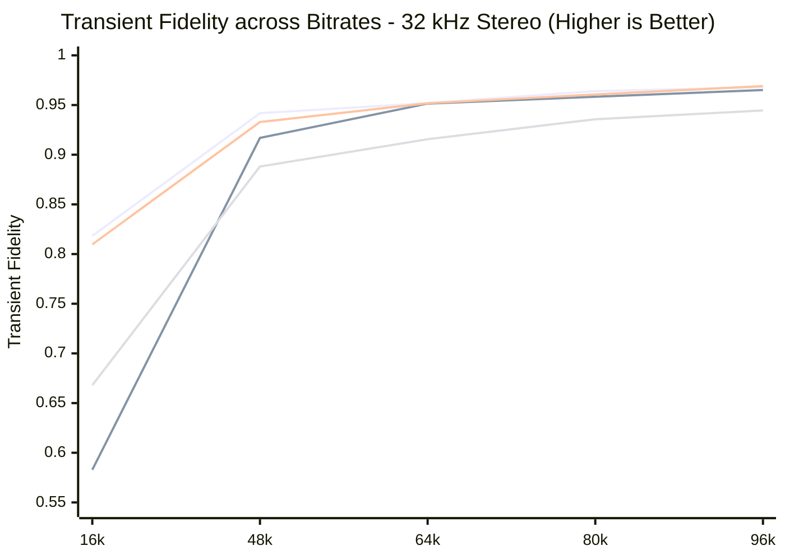
```mermaid
xychart-beta
    title "Transient Fidelity across Bitrates - 32 kHz Stereo (Higher is Better)"
    x-axis ["16k", "48k", "64k", "80k", "96k"]
    y-axis "Transient Fidelity" 0.5442 --> 1
    line "FAAC 2.1.0 (2fbd9db-dirty) (HE)" [0.8183, 0.9418, 0.9520, 0.9640, 0.9680]
    line "FAAC 2.1.0 (2fbd9db-dirty) (LC)" [0.5829, 0.9169, 0.9515, 0.9583, 0.9651]
    line "fdkaac 1.0.0 (LC)" [0.8097, 0.9329, 0.9518, 0.9606, 0.9691]
    line "FFmpeg AAC 6.1.1-3ubuntu5 (LC)" [0.6680, 0.8881, 0.9156, 0.9357, 0.9445]
```

<b>View Detailed Transient Fidelity Table (32 kHz Stereo)</b>

#### LC Profile

| Scenario | FAAC 2.1.0 (2fbd9db-dirty) | fdkaac 1.0.0 | FFmpeg AAC 6.1.1-3ubuntu5 |
| :--- | :---: | :---: | :---: |
| 32k_stereo_16k | 0.5829 █████░░░ | **0.8097** ██████░░ | 0.6680 █████░░░ |
| 32k_stereo_48k | 0.9169 ███████░ | **0.9329** ███████░ | 0.8881 ███████░ |
| 32k_stereo_64k | 0.9515 ████████ | **0.9518** ████████ | 0.9156 ███████░ |
| 32k_stereo_80k | 0.9583 ████████ | **0.9606** ████████ | 0.9357 ███████░ |
| 32k_stereo_96k | 0.9651 ████████ | **0.9691** ████████ | 0.9445 ████████ |

#### HE-v1 Profile

| Scenario | FAAC 2.1.0 (2fbd9db-dirty) |
| :--- | :---: |
| 32k_stereo_16k | **0.8183** ███████░ |
| 32k_stereo_48k | **0.9418** ████████ |
| 32k_stereo_64k | **0.9520** ████████ |
| 32k_stereo_80k | **0.9640** ████████ |
| 32k_stereo_96k | **0.9680** ████████ |

### Bitrate Accuracy (32 kHz Stereo)

> **Note**: Deviation from target bitrate calculated from pure elementary stream audio bytes. **Lower is Better**.

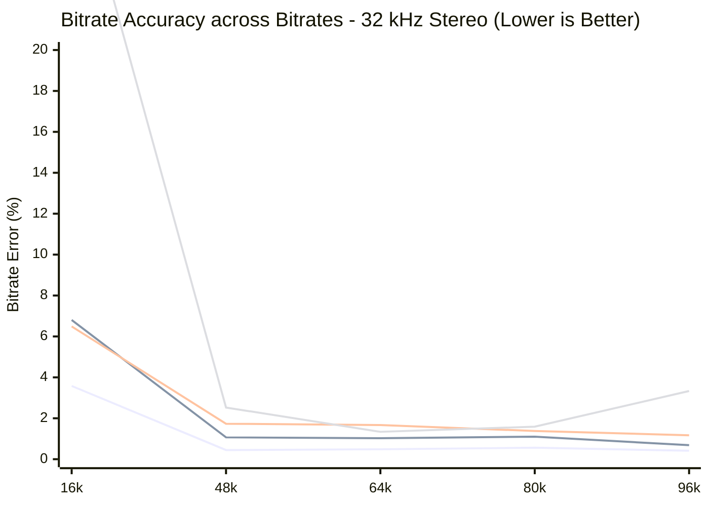
```mermaid
xychart-beta
    title "Bitrate Accuracy across Bitrates - 32 kHz Stereo (Lower is Better)"
    x-axis ["16k", "48k", "64k", "80k", "96k"]
    y-axis "Bitrate Error (%)" 0 --> 20
    line "FAAC 2.1.0 (2fbd9db-dirty) (HE)" [3.5807, 0.4474, 0.4859, 0.5604, 0.4143]
    line "FAAC 2.1.0 (2fbd9db-dirty) (LC)" [6.8054, 1.0662, 1.0269, 1.1008, 0.6857]
    line "fdkaac 1.0.0 (LC)" [6.4901, 1.7332, 1.6709, 1.3788, 1.1685]
    line "FFmpeg AAC 6.1.1-3ubuntu5 (LC)" [29.8966, 2.5253, 1.3389, 1.5879, 3.3340]
```

<b>View Detailed Bitrate Accuracy Table (32 kHz Stereo)</b>

#### LC Profile

| Scenario | FAAC 2.1.0 (2fbd9db-dirty) | fdkaac 1.0.0 | FFmpeg AAC 6.1.1-3ubuntu5 |
| :--- | :---: | :---: | :---: |
| 32k_stereo_16k | 6.8% | **6.5%** | 29.9% |
| 32k_stereo_48k | **1.1%** | 1.7% | 2.5% |
| 32k_stereo_64k | **1.0%** | 1.7% | 1.3% |
| 32k_stereo_80k | **1.1%** | 1.4% | 1.6% |
| 32k_stereo_96k | **0.7%** | 1.2% | 3.3% |

#### HE-v1 Profile

| Scenario | FAAC 2.1.0 (2fbd9db-dirty) |
| :--- | :---: |
| 32k_stereo_16k | **3.6%** |
| 32k_stereo_48k | **0.4%** |
| 32k_stereo_64k | **0.5%** |
| 32k_stereo_80k | **0.6%** |
| 32k_stereo_96k | **0.4%** |

### 44.1 kHz Stereo Quality Across Bitrates

<b>View Detailed 44.1 kHz Stereo Average & Worst MOS Tables</b>

#### Per-Scenario Average MOS (44.1 kHz Stereo)

#### Per-Scenario Worst MOS (Min Clip MOS - 44.1 kHz Stereo)

> **Note**: Minimum perceptual MOS score observed across any clip in the scenario. Highlights edge-case clip degradation. A 🐛 names the clip when every other encoder scored ≥0.75 MOS higher on that exact clip -- likely a defect specific to this encoder; see Quality Outliers under Issues Worth Investigating below.

### Stereo Image Fidelity (44.1 kHz Stereo)

> **Note**: Measured as 1.0 - |Coherence(Ref) - Coherence(Deg)|. **Higher is truer** (closer to reference stereo image).

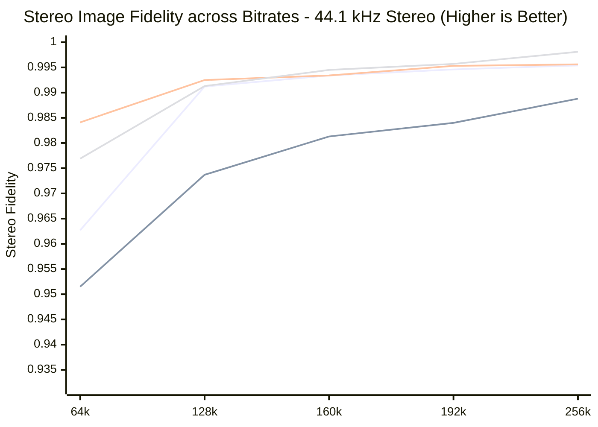
```mermaid
xychart-beta
    title "Stereo Image Fidelity across Bitrates - 44.1 kHz Stereo (Higher is Better)"
    x-axis ["64k", "128k", "160k", "192k", "256k"]
    y-axis "Stereo Fidelity" 0.9315 --> 1
    line "FAAC 2.1.0 (2fbd9db-dirty) (HE)" [0.9627, 0.9912, 0.9934, 0.9946, 0.9954]
    line "FAAC 2.1.0 (2fbd9db-dirty) (LC)" [0.9515, 0.9737, 0.9813, 0.9840, 0.9888]
    line "fdkaac 1.0.0 (LC)" [0.9841, 0.9925, 0.9934, 0.9953, 0.9956]
    line "FFmpeg AAC 6.1.1-3ubuntu5 (LC)" [0.9769, 0.9913, 0.9945, 0.9957, 0.9981]
```

<b>View Detailed Stereo Fidelity Table (44.1 kHz Stereo)</b>

#### LC Profile

| Scenario | FAAC 2.1.0 (2fbd9db-dirty) | fdkaac 1.0.0 | FFmpeg AAC 6.1.1-3ubuntu5 |
| :--- | :---: | :---: | :---: |
| 44k1_stereo_64k | 0.9515 ████████ | **0.9841** ████████ | 0.9769 ████████ |
| 44k1_stereo_128k | 0.9737 ████████ | **0.9925** ████████ | 0.9913 ████████ |
| 44k1_stereo_160k | 0.9813 ████████ | 0.9934 ████████ | **0.9945** ████████ |
| 44k1_stereo_192k | 0.9840 ████████ | 0.9953 ████████ | **0.9957** ████████ |
| 44k1_stereo_256k | 0.9888 ████████ | 0.9956 ████████ | **0.9981** ████████ |

#### HE-v1 Profile

| Scenario | FAAC 2.1.0 (2fbd9db-dirty) |
| :--- | :---: |
| 44k1_stereo_64k | **0.9627** ████████ |
| 44k1_stereo_128k | **0.9912** ████████ |
| 44k1_stereo_160k | **0.9934** ████████ |
| 44k1_stereo_192k | **0.9946** ████████ |
| 44k1_stereo_256k | **0.9954** ████████ |

### Transient Fidelity (44.1 kHz Stereo)

> **Note**: Measured as 1 / (1 + mean |attack-centroid-shift| ms) across onsets. **Higher is truer** (attack timing closer to reference).

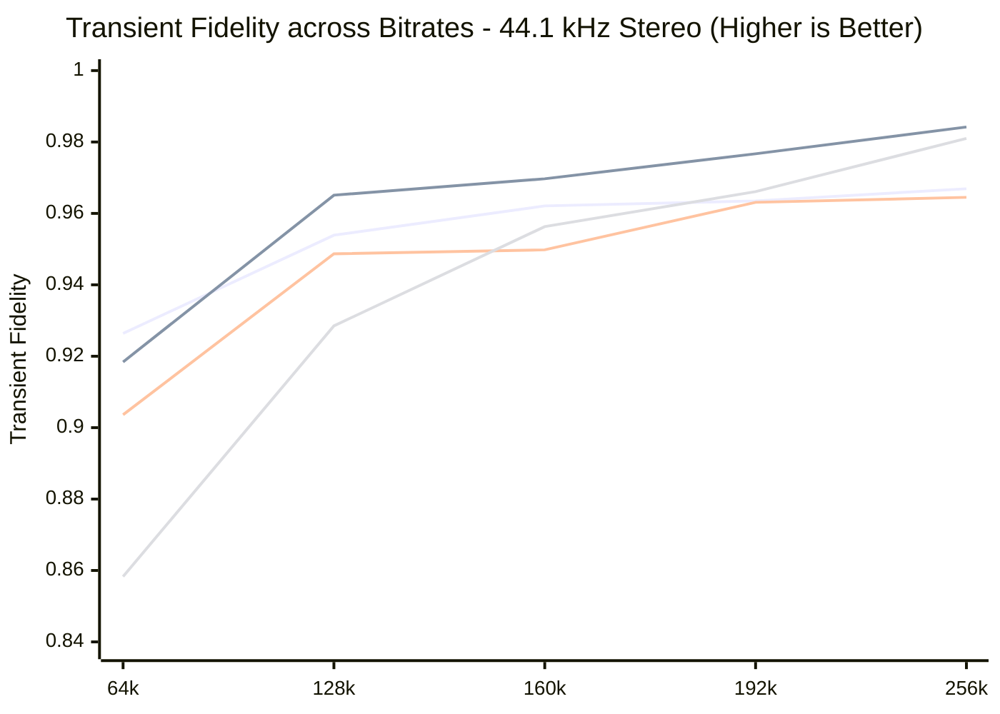
```mermaid
xychart-beta
    title "Transient Fidelity across Bitrates - 44.1 kHz Stereo (Higher is Better)"
    x-axis ["64k", "128k", "160k", "192k", "256k"]
    y-axis "Transient Fidelity" 0.8383 --> 1
    line "FAAC 2.1.0 (2fbd9db-dirty) (HE)" [0.9264, 0.9539, 0.9621, 0.9635, 0.9669]
    line "FAAC 2.1.0 (2fbd9db-dirty) (LC)" [0.9184, 0.9651, 0.9697, 0.9767, 0.9842]
    line "fdkaac 1.0.0 (LC)" [0.9036, 0.9487, 0.9498, 0.9631, 0.9645]
    line "FFmpeg AAC 6.1.1-3ubuntu5 (LC)" [0.8583, 0.9285, 0.9563, 0.9661, 0.9810]
```

<b>View Detailed Transient Fidelity Table (44.1 kHz Stereo)</b>

#### LC Profile

| Scenario | FAAC 2.1.0 (2fbd9db-dirty) | fdkaac 1.0.0 | FFmpeg AAC 6.1.1-3ubuntu5 |
| :--- | :---: | :---: | :---: |
| 44k1_stereo_64k | **0.9184** ███████░ | 0.9036 ███████░ | 0.8583 ███████░ |
| 44k1_stereo_128k | **0.9651** ████████ | 0.9487 ████████ | 0.9285 ███████░ |
| 44k1_stereo_160k | **0.9697** ████████ | 0.9498 ████████ | 0.9563 ████████ |
| 44k1_stereo_192k | **0.9767** ████████ | 0.9631 ████████ | 0.9661 ████████ |
| 44k1_stereo_256k | **0.9842** ████████ | 0.9645 ████████ | 0.9810 ████████ |

#### HE-v1 Profile

| Scenario | FAAC 2.1.0 (2fbd9db-dirty) |
| :--- | :---: |
| 44k1_stereo_64k | **0.9264** ███████░ |
| 44k1_stereo_128k | **0.9539** ████████ |
| 44k1_stereo_160k | **0.9621** ████████ |
| 44k1_stereo_192k | **0.9635** ████████ |
| 44k1_stereo_256k | **0.9669** ████████ |

### Bitrate Accuracy (44.1 kHz Stereo)

> **Note**: Deviation from target bitrate calculated from pure elementary stream audio bytes. **Lower is Better**.

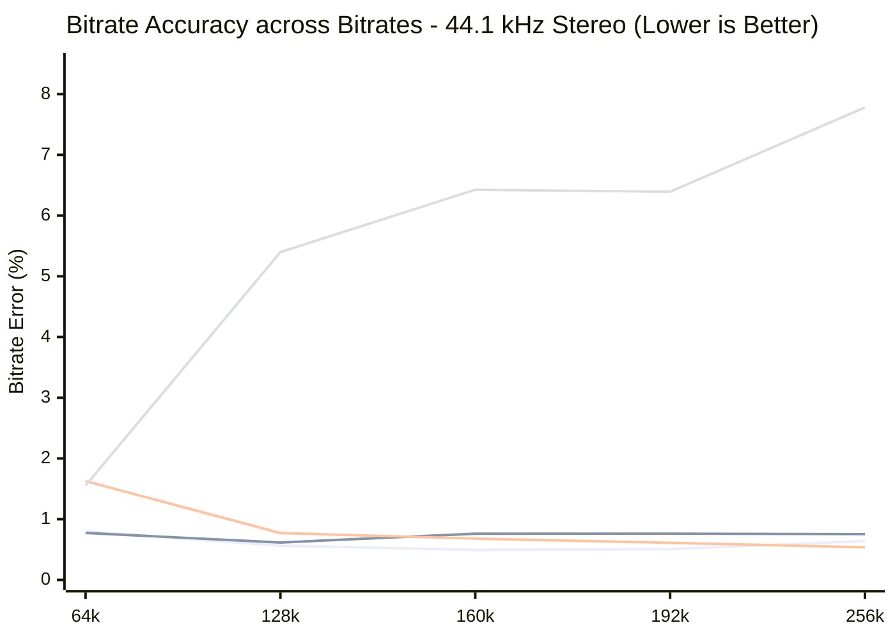
```mermaid
xychart-beta
    title "Bitrate Accuracy across Bitrates - 44.1 kHz Stereo (Lower is Better)"
    x-axis ["64k", "128k", "160k", "192k", "256k"]
    y-axis "Bitrate Error (%)" 0 --> 8.51
    line "FAAC 2.1.0 (2fbd9db-dirty) (HE)" [0.7988, 0.5636, 0.4940, 0.5075, 0.6404]
    line "FAAC 2.1.0 (2fbd9db-dirty) (LC)" [0.7738, 0.6157, 0.7601, 0.7618, 0.7539]
    line "fdkaac 1.0.0 (LC)" [1.6274, 0.7718, 0.6801, 0.6112, 0.5363]
    line "FFmpeg AAC 6.1.1-3ubuntu5 (LC)" [1.5527, 5.3982, 6.4255, 6.3923, 7.7811]
```

<b>View Detailed Bitrate Accuracy Table (44.1 kHz Stereo)</b>

#### LC Profile

| Scenario | FAAC 2.1.0 (2fbd9db-dirty) | fdkaac 1.0.0 | FFmpeg AAC 6.1.1-3ubuntu5 |
| :--- | :---: | :---: | :---: |
| 44k1_stereo_64k | **0.8%** | 1.6% | 1.6% |
| 44k1_stereo_128k | **0.6%** | 0.8% | 5.4% |
| 44k1_stereo_160k | 0.8% | **0.7%** | 6.4% |
| 44k1_stereo_192k | 0.8% | **0.6%** | 6.4% |
| 44k1_stereo_256k | 0.8% | **0.5%** | 7.8% |

#### HE-v1 Profile

| Scenario | FAAC 2.1.0 (2fbd9db-dirty) |
| :--- | :---: |
| 44k1_stereo_64k | **0.8%** |
| 44k1_stereo_128k | **0.6%** |
| 44k1_stereo_160k | **0.5%** |
| 44k1_stereo_192k | **0.5%** |
| 44k1_stereo_256k | **0.6%** |

### 48 kHz Stereo Quality Across Bitrates

<b>View Detailed 48 kHz Stereo Average & Worst MOS Tables</b>

#### Per-Scenario Average MOS (48 kHz Stereo)

#### Per-Scenario Worst MOS (Min Clip MOS - 48 kHz Stereo)

> **Note**: Minimum perceptual MOS score observed across any clip in the scenario. Highlights edge-case clip degradation. A 🐛 names the clip when every other encoder scored ≥0.75 MOS higher on that exact clip -- likely a defect specific to this encoder; see Quality Outliers under Issues Worth Investigating below.

### Stereo Image Fidelity (48 kHz Stereo)

> **Note**: Measured as 1.0 - |Coherence(Ref) - Coherence(Deg)|. **Higher is truer** (closer to reference stereo image).

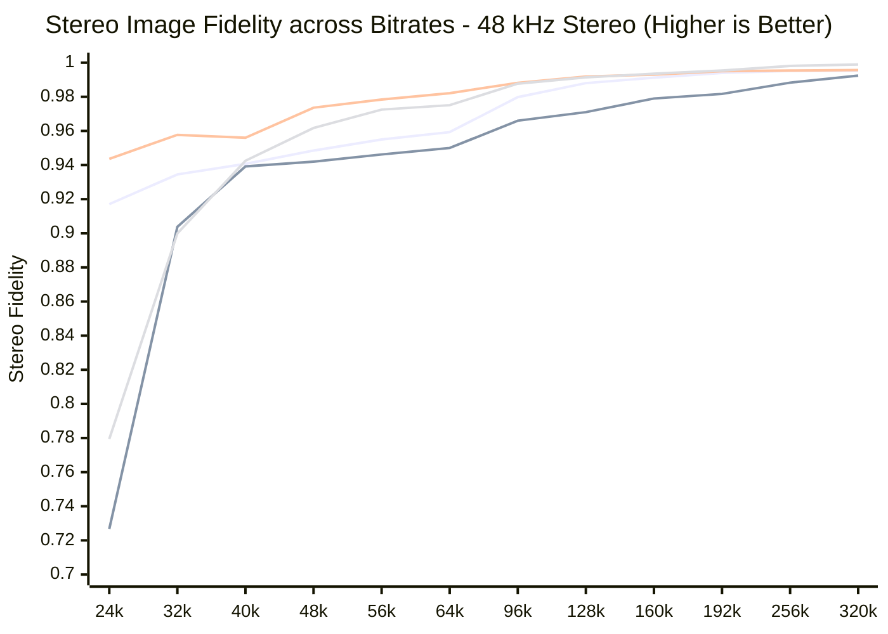
```mermaid
xychart-beta
    title "Stereo Image Fidelity across Bitrates - 48 kHz Stereo (Higher is Better)"
    x-axis ["24k", "32k", "40k", "48k", "56k", "64k", "96k", "128k", "160k", "192k", "256k", "320k"]
    y-axis "Stereo Fidelity" 0.6995 --> 1
    line "FAAC 2.1.0 (2fbd9db-dirty) (HE)" [0.9171, 0.9345, 0.9407, 0.9485, 0.9550, 0.9593, 0.9798, 0.9880, 0.9912, 0.9940, 0.9952, 0.9952]
    line "FAAC 2.1.0 (2fbd9db-dirty) (LC)" [0.7267, 0.9038, 0.9392, 0.9420, 0.9462, 0.9500, 0.9660, 0.9710, 0.9790, 0.9817, 0.9883, 0.9924]
    line "fdkaac 1.0.0 (LC)" [0.9436, 0.9577, 0.9560, 0.9736, 0.9784, 0.9821, 0.9882, 0.9919, 0.9930, 0.9950, 0.9954, 0.9957]
    line "FFmpeg AAC 6.1.1-3ubuntu5 (LC)" [0.7794, 0.8999, 0.9425, 0.9617, 0.9725, 0.9751, 0.9877, 0.9914, 0.9935, 0.9954, 0.9981, 0.9989]
```

<b>View Detailed Stereo Fidelity Table (48 kHz Stereo)</b>

#### LC Profile

| Scenario | FAAC 2.1.0 (2fbd9db-dirty) | fdkaac 1.0.0 | FFmpeg AAC 6.1.1-3ubuntu5 |
| :--- | :---: | :---: | :---: |
| 48k_stereo_24k | 0.7267 ██████░░ | **0.9436** ████████ | 0.7794 ██████░░ |
| 48k_stereo_32k | 0.9038 ███████░ | **0.9577** ████████ | 0.8999 ███████░ |
| 48k_stereo_40k | 0.9392 ████████ | **0.9560** ████████ | 0.9425 ████████ |
| 48k_stereo_48k | 0.9420 ████████ | **0.9736** ████████ | 0.9617 ████████ |
| 48k_stereo_56k | 0.9462 ████████ | **0.9784** ████████ | 0.9725 ████████ |
| 48k_stereo_64k | 0.9500 ████████ | **0.9821** ████████ | 0.9751 ████████ |
| 48k_stereo_96k | 0.9660 ████████ | **0.9882** ████████ | 0.9877 ████████ |
| 48k_stereo_128k | 0.9710 ████████ | **0.9919** ████████ | 0.9914 ████████ |
| 48k_stereo_160k | 0.9790 ████████ | 0.9930 ████████ | **0.9935** ████████ |
| 48k_stereo_192k | 0.9817 ████████ | 0.9950 ████████ | **0.9954** ████████ |
| 48k_stereo_256k | 0.9883 ████████ | 0.9954 ████████ | **0.9981** ████████ |
| 48k_stereo_320k | 0.9924 ████████ | 0.9957 ████████ | **0.9989** ████████ |

#### HE-v1 Profile

| Scenario | FAAC 2.1.0 (2fbd9db-dirty) |
| :--- | :---: |
| 48k_stereo_24k | **0.9171** ███████░ |
| 48k_stereo_32k | **0.9345** ███████░ |
| 48k_stereo_40k | **0.9407** ████████ |
| 48k_stereo_48k | **0.9485** ████████ |
| 48k_stereo_56k | **0.9550** ████████ |
| 48k_stereo_64k | **0.9593** ████████ |
| 48k_stereo_96k | **0.9798** ████████ |
| 48k_stereo_128k | **0.9880** ████████ |
| 48k_stereo_160k | **0.9912** ████████ |
| 48k_stereo_192k | **0.9940** ████████ |
| 48k_stereo_256k | **0.9952** ████████ |
| 48k_stereo_320k | **0.9952** ████████ |

### Transient Fidelity (48 kHz Stereo)

> **Note**: Measured as 1 / (1 + mean |attack-centroid-shift| ms) across onsets. **Higher is truer** (attack timing closer to reference).

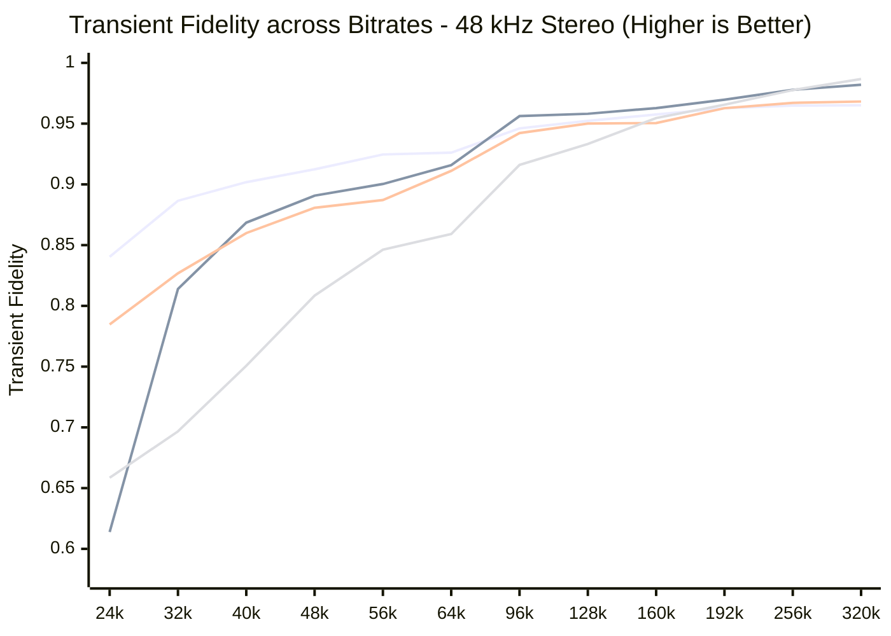
```mermaid
xychart-beta
    title "Transient Fidelity across Bitrates - 48 kHz Stereo (Higher is Better)"
    x-axis ["24k", "32k", "40k", "48k", "56k", "64k", "96k", "128k", "160k", "192k", "256k", "320k"]
    y-axis "Transient Fidelity" 0.5767 --> 1
    line "FAAC 2.1.0 (2fbd9db-dirty) (HE)" [0.8404, 0.8865, 0.9018, 0.9124, 0.9246, 0.9261, 0.9461, 0.9523, 0.9575, 0.9628, 0.9648, 0.9651]
    line "FAAC 2.1.0 (2fbd9db-dirty) (LC)" [0.6139, 0.8139, 0.8685, 0.8907, 0.9003, 0.9158, 0.9562, 0.9581, 0.9628, 0.9697, 0.9778, 0.9820]
    line "fdkaac 1.0.0 (LC)" [0.7847, 0.8268, 0.8599, 0.8807, 0.8871, 0.9111, 0.9422, 0.9501, 0.9505, 0.9627, 0.9671, 0.9682]
    line "FFmpeg AAC 6.1.1-3ubuntu5 (LC)" [0.6585, 0.6967, 0.7507, 0.8084, 0.8462, 0.8591, 0.9160, 0.9332, 0.9546, 0.9656, 0.9776, 0.9867]
```

<b>View Detailed Transient Fidelity Table (48 kHz Stereo)</b>

#### LC Profile

| Scenario | FAAC 2.1.0 (2fbd9db-dirty) | fdkaac 1.0.0 | FFmpeg AAC 6.1.1-3ubuntu5 |
| :--- | :---: | :---: | :---: |
| 48k_stereo_24k | 0.6139 █████░░░ | **0.7847** ██████░░ | 0.6585 █████░░░ |
| 48k_stereo_32k | 0.8139 ███████░ | **0.8268** ███████░ | 0.6967 ██████░░ |
| 48k_stereo_40k | **0.8685** ███████░ | 0.8599 ███████░ | 0.7507 ██████░░ |
| 48k_stereo_48k | **0.8907** ███████░ | 0.8807 ███████░ | 0.8084 ██████░░ |
| 48k_stereo_56k | **0.9003** ███████░ | 0.8871 ███████░ | 0.8462 ███████░ |
| 48k_stereo_64k | **0.9158** ███████░ | 0.9111 ███████░ | 0.8591 ███████░ |
| 48k_stereo_96k | **0.9562** ████████ | 0.9422 ████████ | 0.9160 ███████░ |
| 48k_stereo_128k | **0.9581** ████████ | 0.9501 ████████ | 0.9332 ███████░ |
| 48k_stereo_160k | **0.9628** ████████ | 0.9505 ████████ | 0.9546 ████████ |
| 48k_stereo_192k | **0.9697** ████████ | 0.9627 ████████ | 0.9656 ████████ |
| 48k_stereo_256k | **0.9778** ████████ | 0.9671 ████████ | 0.9776 ████████ |
| 48k_stereo_320k | 0.9820 ████████ | 0.9682 ████████ | **0.9867** ████████ |

#### HE-v1 Profile

| Scenario | FAAC 2.1.0 (2fbd9db-dirty) |
| :--- | :---: |
| 48k_stereo_24k | **0.8404** ███████░ |
| 48k_stereo_32k | **0.8865** ███████░ |
| 48k_stereo_40k | **0.9018** ███████░ |
| 48k_stereo_48k | **0.9124** ███████░ |
| 48k_stereo_56k | **0.9246** ███████░ |
| 48k_stereo_64k | **0.9261** ███████░ |
| 48k_stereo_96k | **0.9461** ████████ |
| 48k_stereo_128k | **0.9523** ████████ |
| 48k_stereo_160k | **0.9575** ████████ |
| 48k_stereo_192k | **0.9628** ████████ |
| 48k_stereo_256k | **0.9648** ████████ |
| 48k_stereo_320k | **0.9651** ████████ |

### Bitrate Accuracy (48 kHz Stereo)

> **Note**: Deviation from target bitrate calculated from pure elementary stream audio bytes. **Lower is Better**.

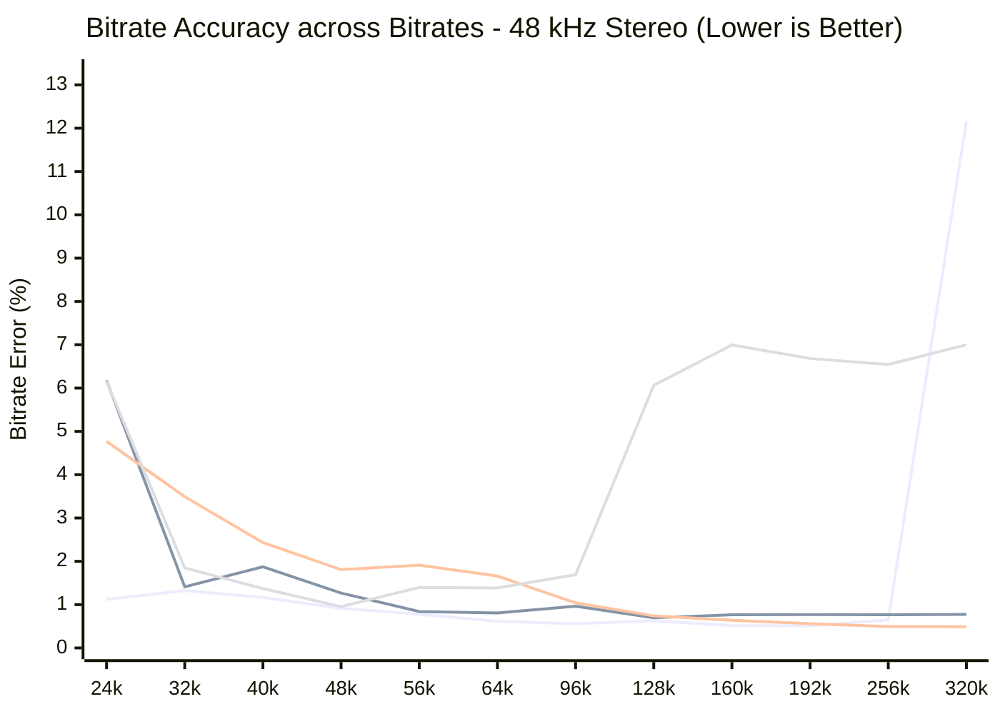
```mermaid
xychart-beta
    title "Bitrate Accuracy across Bitrates - 48 kHz Stereo (Lower is Better)"
    x-axis ["24k", "32k", "40k", "48k", "56k", "64k", "96k", "128k", "160k", "192k", "256k", "320k"]
    y-axis "Bitrate Error (%)" 0 --> 13.33
    line "FAAC 2.1.0 (2fbd9db-dirty) (HE)" [1.1196, 1.3259, 1.1649, 0.9152, 0.7793, 0.6165, 0.5600, 0.6317, 0.5166, 0.5122, 0.6483, 12.1672]
    line "FAAC 2.1.0 (2fbd9db-dirty) (LC)" [6.1754, 1.4122, 1.8728, 1.2681, 0.8415, 0.8075, 0.9635, 0.6966, 0.7667, 0.7688, 0.7665, 0.7759]
    line "fdkaac 1.0.0 (LC)" [4.7694, 3.4914, 2.4328, 1.8087, 1.9127, 1.6604, 1.0419, 0.7405, 0.6402, 0.5604, 0.4937, 0.4911]
    line "FFmpeg AAC 6.1.1-3ubuntu5 (LC)" [6.1520, 1.8478, 1.3716, 0.9542, 1.3972, 1.3854, 1.6908, 6.0628, 6.9949, 6.6822, 6.5442, 6.9997]
```

<b>View Detailed Bitrate Accuracy Table (48 kHz Stereo)</b>

#### LC Profile

| Scenario | FAAC 2.1.0 (2fbd9db-dirty) | fdkaac 1.0.0 | FFmpeg AAC 6.1.1-3ubuntu5 |
| :--- | :---: | :---: | :---: |
| 48k_stereo_24k | 6.2% | **4.8%** | 6.2% |
| 48k_stereo_32k | **1.4%** | 3.5% | 1.8% |
| 48k_stereo_40k | 1.9% | 2.4% | **1.4%** |
| 48k_stereo_48k | 1.3% | 1.8% | **1.0%** |
| 48k_stereo_56k | **0.8%** | 1.9% | 1.4% |
| 48k_stereo_64k | **0.8%** | 1.7% | 1.4% |
| 48k_stereo_96k | **1.0%** | 1.0% | 1.7% |
| 48k_stereo_128k | **0.7%** | 0.7% | 6.1% |
| 48k_stereo_160k | 0.8% | **0.6%** | 7.0% |
| 48k_stereo_192k | 0.8% | **0.6%** | 6.7% |
| 48k_stereo_256k | 0.8% | **0.5%** | 6.5% |
| 48k_stereo_320k | 0.8% | **0.5%** | 7.0% |

#### HE-v1 Profile

| Scenario | FAAC 2.1.0 (2fbd9db-dirty) |
| :--- | :---: |
| 48k_stereo_24k | **1.1%** |
| 48k_stereo_32k | **1.3%** |
| 48k_stereo_40k | **1.2%** |
| 48k_stereo_48k | **0.9%** |
| 48k_stereo_56k | **0.8%** |
| 48k_stereo_64k | **0.6%** |
| 48k_stereo_96k | **0.6%** |
| 48k_stereo_128k | **0.6%** |
| 48k_stereo_160k | **0.5%** |
| 48k_stereo_192k | **0.5%** |
| 48k_stereo_256k | **0.6%** |
| 48k_stereo_320k | **12.2%** |

### 44.1 kHz 5.1 Surround Quality Across Bitrates

<b>View Detailed 44.1 kHz 5.1 Surround Average & Worst MOS Tables</b>

#### Per-Scenario Average MOS (44.1 kHz 5.1 Surround)

#### Per-Scenario Worst MOS (Min Clip MOS - 44.1 kHz 5.1 Surround)

> **Note**: Minimum perceptual MOS score observed across any clip in the scenario. Highlights edge-case clip degradation. A 🐛 names the clip when every other encoder scored ≥0.75 MOS higher on that exact clip -- likely a defect specific to this encoder; see Quality Outliers under Issues Worth Investigating below.

### Stereo Image Fidelity (44.1 kHz 5.1 Surround)

> **Note**: Measured as 1.0 - |Coherence(Ref) - Coherence(Deg)|. **Higher is truer** (closer to reference stereo image).

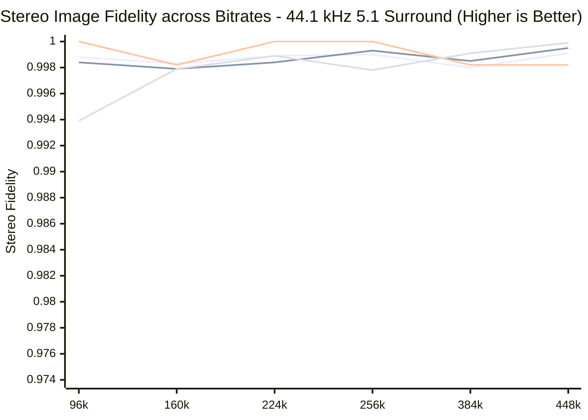
```mermaid
xychart-beta
    title "Stereo Image Fidelity across Bitrates - 44.1 kHz 5.1 Surround (Higher is Better)"
    x-axis ["96k", "160k", "224k", "256k", "384k", "448k"]
    y-axis "Stereo Fidelity" 0.9739 --> 1
    line "FAAC 2.1.0 (2fbd9db-dirty) (HE)" [0.9988, 0.9983, 0.9989, 0.9990, 0.9980, 0.9991]
    line "FAAC 2.1.0 (2fbd9db-dirty) (LC)" [0.9984, 0.9979, 0.9984, 0.9993, 0.9985, 0.9995]
    line "fdkaac 1.0.0 (LC)" [1.0000, 0.9982, 1.0000, 1.0000, 0.9982, 0.9982]
    line "FFmpeg AAC 6.1.1-3ubuntu5 (LC)" [0.9939, 0.9979, 0.9989, 0.9978, 0.9991, 0.9999]
```

<b>View Detailed Stereo Fidelity Table (44.1 kHz 5.1 Surround)</b>

#### LC Profile

| Scenario | FAAC 2.1.0 (2fbd9db-dirty) | fdkaac 1.0.0 | FFmpeg AAC 6.1.1-3ubuntu5 |
| :--- | :---: | :---: | :---: |
| 44k1_51_96k | 0.9984 ████████ | **1.0000** ████████ | 0.9939 ████████ |
| 44k1_51_160k | 0.9979 ████████ | **0.9982** ████████ | 0.9979 ████████ |
| 44k1_51_224k | 0.9984 ████████ | **1.0000** ████████ | 0.9989 ████████ |
| 44k1_51_256k | 0.9993 ████████ | **1.0000** ████████ | 0.9978 ████████ |
| 44k1_51_384k | 0.9985 ████████ | 0.9982 ████████ | **0.9991** ████████ |
| 44k1_51_448k | 0.9995 ████████ | 0.9982 ████████ | **0.9999** ████████ |

#### HE-v1 Profile

| Scenario | FAAC 2.1.0 (2fbd9db-dirty) |
| :--- | :---: |
| 44k1_51_96k | **0.9988** ████████ |
| 44k1_51_160k | **0.9983** ████████ |
| 44k1_51_224k | **0.9989** ████████ |
| 44k1_51_256k | **0.9990** ████████ |
| 44k1_51_384k | **0.9980** ████████ |
| 44k1_51_448k | **0.9991** ████████ |

### Transient Fidelity (44.1 kHz 5.1 Surround)

> **Note**: Measured as 1 / (1 + mean |attack-centroid-shift| ms) across onsets. **Higher is truer** (attack timing closer to reference).

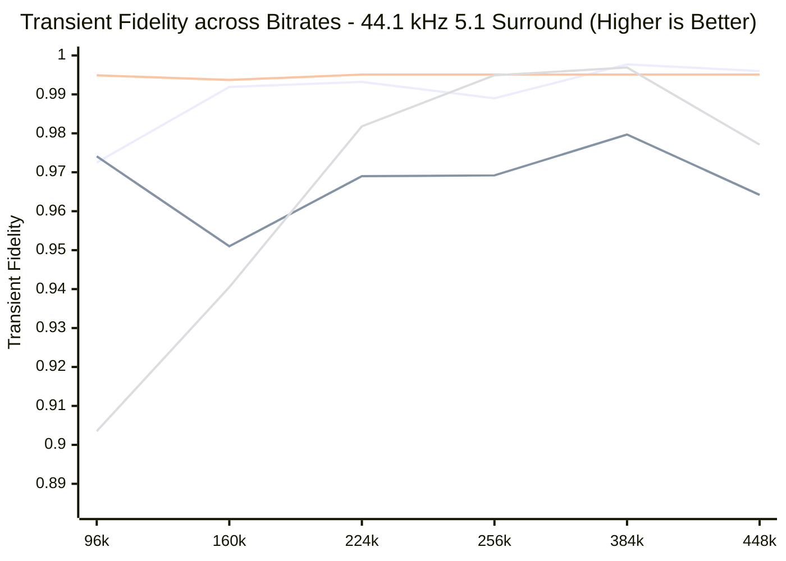
```mermaid
xychart-beta
    title "Transient Fidelity across Bitrates - 44.1 kHz 5.1 Surround (Higher is Better)"
    x-axis ["96k", "160k", "224k", "256k", "384k", "448k"]
    y-axis "Transient Fidelity" 0.8835 --> 1
    line "FAAC 2.1.0 (2fbd9db-dirty) (HE)" [0.9725, 0.9919, 0.9932, 0.9890, 0.9977, 0.9960]
    line "FAAC 2.1.0 (2fbd9db-dirty) (LC)" [0.9741, 0.9510, 0.9690, 0.9692, 0.9797, 0.9642]
    line "fdkaac 1.0.0 (LC)" [0.9949, 0.9937, 0.9951, 0.9951, 0.9951, 0.9951]
    line "FFmpeg AAC 6.1.1-3ubuntu5 (LC)" [0.9035, 0.9405, 0.9818, 0.9949, 0.9969, 0.9771]
```

<b>View Detailed Transient Fidelity Table (44.1 kHz 5.1 Surround)</b>

#### LC Profile

| Scenario | FAAC 2.1.0 (2fbd9db-dirty) | fdkaac 1.0.0 | FFmpeg AAC 6.1.1-3ubuntu5 |
| :--- | :---: | :---: | :---: |
| 44k1_51_96k | 0.9741 ████████ | **0.9949** ████████ | 0.9035 ███████░ |
| 44k1_51_160k | 0.9510 ████████ | **0.9937** ████████ | 0.9405 ████████ |
| 44k1_51_224k | 0.9690 ████████ | **0.9951** ████████ | 0.9818 ████████ |
| 44k1_51_256k | 0.9692 ████████ | **0.9951** ████████ | 0.9949 ████████ |
| 44k1_51_384k | 0.9797 ████████ | 0.9951 ████████ | **0.9969** ████████ |
| 44k1_51_448k | 0.9642 ████████ | **0.9951** ████████ | 0.9771 ████████ |

#### HE-v1 Profile

| Scenario | FAAC 2.1.0 (2fbd9db-dirty) |
| :--- | :---: |
| 44k1_51_96k | **0.9725** ████████ |
| 44k1_51_160k | **0.9919** ████████ |
| 44k1_51_224k | **0.9932** ████████ |
| 44k1_51_256k | **0.9890** ████████ |
| 44k1_51_384k | **0.9977** ████████ |
| 44k1_51_448k | **0.9960** ████████ |

### Bitrate Accuracy (44.1 kHz 5.1 Surround)

> **Note**: Deviation from target bitrate calculated from pure elementary stream audio bytes. **Lower is Better**.

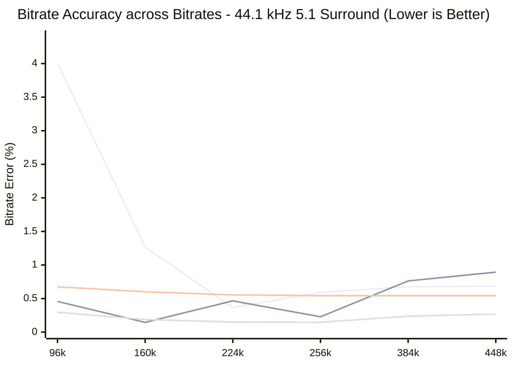
```mermaid
xychart-beta
    title "Bitrate Accuracy across Bitrates - 44.1 kHz 5.1 Surround (Lower is Better)"
    x-axis ["96k", "160k", "224k", "256k", "384k", "448k"]
    y-axis "Bitrate Error (%)" 0 --> 4.408
    line "FAAC 2.1.0 (2fbd9db-dirty) (HE)" [4.0075, 1.2660, 0.3668, 0.5944, 0.6758, 0.6841]
    line "FAAC 2.1.0 (2fbd9db-dirty) (LC)" [0.4575, 0.1450, 0.4657, 0.2291, 0.7623, 0.8939]
    line "fdkaac 1.0.0 (LC)" [0.6750, 0.6010, 0.5543, 0.5425, 0.5423, 0.5423]
    line "FFmpeg AAC 6.1.1-3ubuntu5 (LC)" [0.2958, 0.1885, 0.1500, 0.1475, 0.2373, 0.2686]
```

<b>View Detailed Bitrate Accuracy Table (44.1 kHz 5.1 Surround)</b>

#### LC Profile

| Scenario | FAAC 2.1.0 (2fbd9db-dirty) | fdkaac 1.0.0 | FFmpeg AAC 6.1.1-3ubuntu5 |
| :--- | :---: | :---: | :---: |
| 44k1_51_96k | 0.5% | 0.7% | **0.3%** |
| 44k1_51_160k | **0.1%** | 0.6% | 0.2% |
| 44k1_51_224k | 0.5% | 0.6% | **0.2%** |
| 44k1_51_256k | 0.2% | 0.5% | **0.1%** |
| 44k1_51_384k | 0.8% | 0.5% | **0.2%** |
| 44k1_51_448k | 0.9% | 0.5% | **0.3%** |

#### HE-v1 Profile

| Scenario | FAAC 2.1.0 (2fbd9db-dirty) |
| :--- | :---: |
| 44k1_51_96k | **4.0%** |
| 44k1_51_160k | **1.3%** |
| 44k1_51_224k | **0.4%** |
| 44k1_51_256k | **0.6%** |
| 44k1_51_384k | **0.7%** |
| 44k1_51_448k | **0.7%** |

### BD-Rate Relative Efficiency (vs FAAC 2.1.0 (2fbd9db-dirty))

> **Note**: Bjontegaard-delta rate (BD-rate) measures the average percentage difference in bitrate for equal perceptual quality (MOS). **Negative % = candidate is more efficient** (uses fewer bits for same quality). BD-rate holds quality fixed by construction, avoiding bitrate-bias traps of raw fixed-rate MOS deltas.

_No valid BD-rate ladders found between baseline and candidate encoders._

### Encoder Efficiency & Footprint

#### Encoding Speed (xRT)

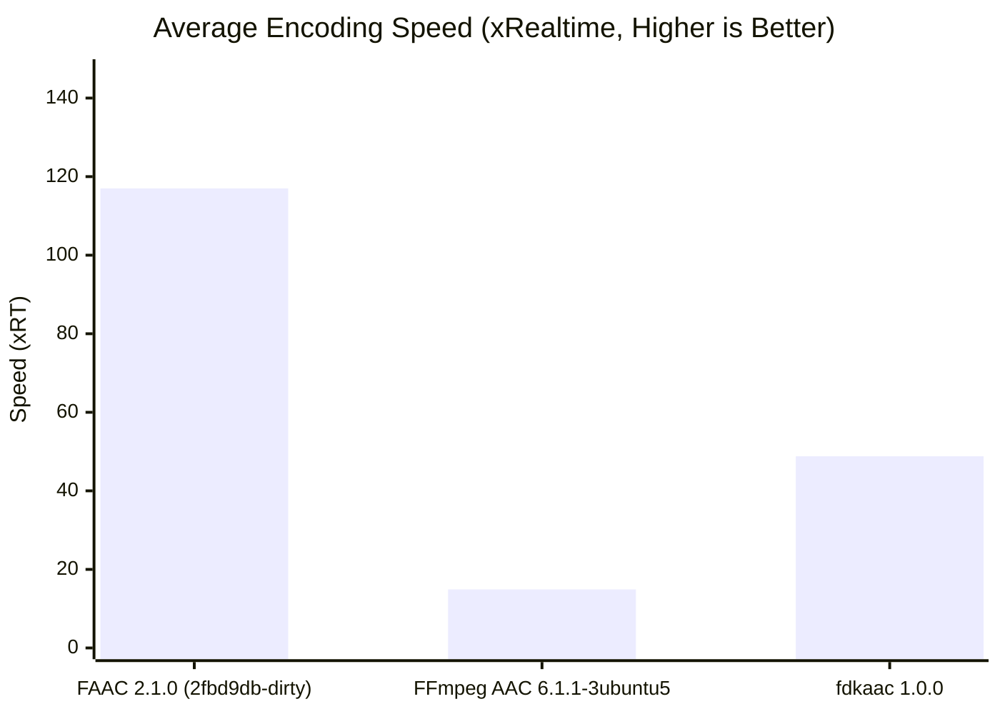
```mermaid
xychart-beta
    title "Average Encoding Speed (xRealtime, Higher is Better)"
    x-axis ["FAAC 2.1.0 (2fbd9db-dirty)", "FFmpeg AAC 6.1.1-3ubuntu5", "fdkaac 1.0.0"]
    y-axis "Speed (xRT)" 0 --> 147
    bar [117.0, 14.9, 48.8]
```

#### Codec ROM (Flash) Size

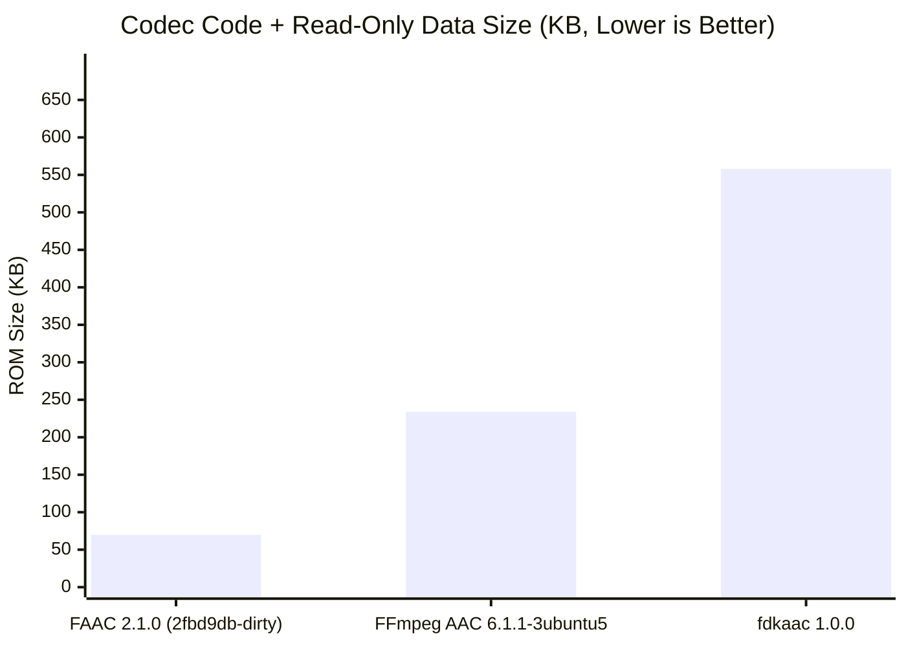
```mermaid
xychart-beta
    title "Codec Code + Read-Only Data Size (KB, Lower is Better)"
    x-axis ["FAAC 2.1.0 (2fbd9db-dirty)", "FFmpeg AAC 6.1.1-3ubuntu5", "fdkaac 1.0.0"]
    y-axis "ROM Size (KB)" 0 --> 698
    bar [69.7, 234.0, 558.1]
```

<b>View Detailed Per-Scenario Efficiency Table</b>

#### LC Profile

| Scenario | FAAC 2.1.0 (2fbd9db-dirty) | fdkaac 1.0.0 | FFmpeg AAC 6.1.1-3ubuntu5 |
| :--- | :---: | :---: | :---: |
| 16k_mono_20k | **100.5x** █████░░░ | 80.7x ████░░░░ | 31.5x ██░░░░░░ |
| 16k_mono_24k | **109.2x** ██████░░ | 86.9x █████░░░ | 22.5x █░░░░░░░ |
| 16k_mono_voip_24k | **116.8x** ██████░░ | 87.8x █████░░░ | 29.9x ██░░░░░░ |
| 24k_mono_28k | **121.4x** ███████░ | 95.5x █████░░░ | 29.0x ██░░░░░░ |
| 24k_mono_32k | **102.0x** ██████░░ | 79.9x ████░░░░ | 27.5x █░░░░░░░ |
| 32k_stereo_16k | **114.0x** ██████░░ | 60.4x ███░░░░░ | 15.6x █░░░░░░░ |
| 32k_stereo_48k | **128.9x** ███████░ | 54.3x ███░░░░░ | 17.2x █░░░░░░░ |
| 32k_stereo_64k | **143.3x** ████████ | 46.1x ██░░░░░░ | 15.4x █░░░░░░░ |
| 32k_stereo_80k | **147.9x** ████████ | 40.2x ██░░░░░░ | 13.3x █░░░░░░░ |
| 32k_stereo_96k | **123.1x** ███████░ | 43.1x ██░░░░░░ | 12.9x █░░░░░░░ |
| 44k1_stereo_64k | **127.6x** ███████░ | 41.3x ██░░░░░░ | 13.5x █░░░░░░░ |
| 44k1_stereo_128k | **115.5x** ██████░░ | 38.2x ██░░░░░░ | 11.5x █░░░░░░░ |
| 44k1_stereo_160k | **119.1x** ██████░░ | 33.8x ██░░░░░░ | 11.3x █░░░░░░░ |
| 44k1_stereo_192k | **110.8x** ██████░░ | 35.6x ██░░░░░░ | 11.2x █░░░░░░░ |
| 44k1_stereo_256k | **114.6x** ██████░░ | 31.6x ██░░░░░░ | 10.9x █░░░░░░░ |
| 48k_stereo_24k | **122.9x** ███████░ | 60.8x ███░░░░░ | 16.3x █░░░░░░░ |
| 48k_stereo_32k | **146.2x** ████████ | 63.9x ███░░░░░ | 16.4x █░░░░░░░ |
| 48k_stereo_40k | **100.9x** █████░░░ | 46.2x ███░░░░░ | 12.7x █░░░░░░░ |
| 48k_stereo_48k | **128.7x** ███████░ | 47.0x ███░░░░░ | 12.3x █░░░░░░░ |
| 48k_stereo_56k | **108.1x** ██████░░ | 43.7x ██░░░░░░ | 13.7x █░░░░░░░ |
| 48k_stereo_64k | **127.4x** ███████░ | 41.6x ██░░░░░░ | 13.5x █░░░░░░░ |
| 48k_stereo_96k | **133.6x** ███████░ | 43.4x ██░░░░░░ | 13.8x █░░░░░░░ |
| 48k_stereo_128k | **133.4x** ███████░ | 42.0x ██░░░░░░ | 14.1x █░░░░░░░ |
| 48k_stereo_160k | **126.8x** ███████░ | 39.7x ██░░░░░░ | 13.3x █░░░░░░░ |
| 48k_stereo_192k | **123.6x** ███████░ | 39.4x ██░░░░░░ | 12.6x █░░░░░░░ |
| 48k_stereo_256k | **125.0x** ███████░ | 37.0x ██░░░░░░ | 14.2x █░░░░░░░ |
| 48k_stereo_320k | **118.1x** ██████░░ | 34.9x ██░░░░░░ | 13.2x █░░░░░░░ |
| 44k1_51_96k | **104.6x** ██████░░ | 43.7x ██░░░░░░ | 10.4x █░░░░░░░ |
| 44k1_51_160k | **97.7x** █████░░░ | 33.4x ██░░░░░░ | 7.9x ░░░░░░░░ |
| 44k1_51_224k | **98.7x** █████░░░ | 32.8x ██░░░░░░ | 8.1x ░░░░░░░░ |
| 44k1_51_256k | **95.8x** █████░░░ | 35.7x ██░░░░░░ | 8.2x ░░░░░░░░ |
| 44k1_51_384k | **89.0x** █████░░░ | 34.8x ██░░░░░░ | 7.0x ░░░░░░░░ |
| 44k1_51_448k | **84.6x** █████░░░ | 35.3x ██░░░░░░ | 10.6x █░░░░░░░ |

#### HE-v1 Profile

| Scenario | FAAC 2.1.0 (2fbd9db-dirty) |
| :--- | :---: |
| 16k_mono_20k | N/A |
| 16k_mono_24k | N/A |
| 16k_mono_voip_24k | N/A |
| 24k_mono_28k | N/A |
| 24k_mono_32k | N/A |
| 32k_stereo_16k | **96.0x** ██████░░ |
| 32k_stereo_48k | **109.8x** ██████░░ |
| 32k_stereo_64k | **127.2x** ████████ |
| 32k_stereo_80k | **135.3x** ████████ |
| 32k_stereo_96k | **126.8x** ███████░ |
| 44k1_stereo_64k | **110.6x** ███████░ |
| 44k1_stereo_128k | **112.0x** ███████░ |
| 44k1_stereo_160k | **111.4x** ███████░ |
| 44k1_stereo_192k | **97.6x** ██████░░ |
| 44k1_stereo_256k | **93.7x** ██████░░ |
| 48k_stereo_24k | **90.5x** █████░░░ |
| 48k_stereo_32k | **132.9x** ████████ |
| 48k_stereo_40k | **99.9x** ██████░░ |
| 48k_stereo_48k | **117.5x** ███████░ |
| 48k_stereo_56k | **107.2x** ██████░░ |
| 48k_stereo_64k | **127.0x** ████████ |
| 48k_stereo_96k | **125.3x** ███████░ |
| 48k_stereo_128k | **127.1x** ████████ |
| 48k_stereo_160k | **121.2x** ███████░ |
| 48k_stereo_192k | **118.6x** ███████░ |
| 48k_stereo_256k | **111.5x** ███████░ |
| 48k_stereo_320k | **91.1x** █████░░░ |
| 44k1_51_96k | **87.6x** █████░░░ |
| 44k1_51_160k | **85.9x** █████░░░ |
| 44k1_51_224k | **80.3x** █████░░░ |
| 44k1_51_256k | **81.2x** █████░░░ |
| 44k1_51_384k | **79.6x** █████░░░ |
| 44k1_51_448k | **78.5x** █████░░░ |

---
**Metric Legend**:
- **Ranking**: by Worst MOS, then Overall MOS as tiebreaker.
- **Quality (MOS)**: Perceptual audio quality (1-5, **Higher is Better**)
- **Stereo Fidelity**: Faithfulness of stereo image (0-1, **Higher is Better**)
- **Transient Fidelity**: How little attacks are smeared/delayed (0-1, **Higher is Better**)
- **Speed**: Encoding throughput (**Higher is Better**)
- **Bitrate Error**: Deviation from target bitrate (**Lower is Better**)
- **ROM (Flash)**: Codec code + read-only data size (**Lower is Better**)

---

## 🔊 Decoder Leaderboard

Objective evaluation of AAC decoders on Spec Conformance (SNR), Decoded Quality (MOS), Timing Alignment Error, Robustness, Speed, and Footprint.

### Overall Decoder Rankings

| Rank | Decoder | Status | Worst MOS | Overall MOS | Mean SNR | Timing Error | Robustness | Speed (xRT) | Peak RAM | ROM (Flash) |
| :--- | :--- | :---: | :---: | :---: | :---: | :---: | :---: | :---: | :---: | :---: |
| 1 | FAAD | OK | 0.000 | 0.000 | 15.6 dB | 0.00 ms | **99.2%** | 127.9x | 12.0 MB | 113.4 KB |
| 2 | FFmpeg AAC 6.1.1-3ubuntu5 | OK | 0.000 | 0.000 | 23.0 dB | 4.94 ms | 0.0% | 61.4x | 54.1 MB | 234.0 KB |
| 3 | Helix AAC 1.0 | ⚠️ (1x timeout) | 0.000 | 0.000 | 19.4 dB | 48.92 ms | 66.9% | **142.0x** | 12.0 MB | 120.0 KB |

<b>📊 View Per-Scenario Decoder Breakdowns</b>

### Detailed Per-Scenario Decoder Breakdowns

#### 16 kHz Mono Speech

##### Per-Scenario Average MOS (16 kHz Mono Speech)

##### Spec Conformance (Mean SNR - 16 kHz Mono Speech)

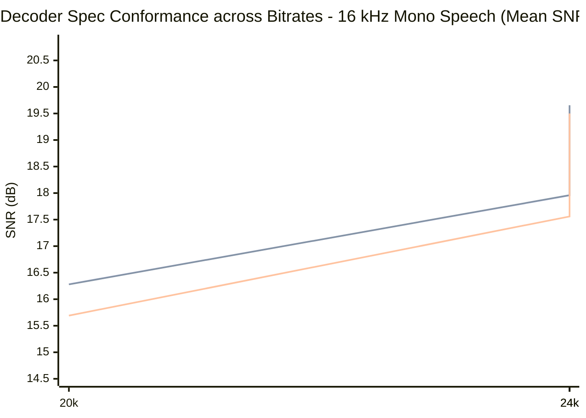
```mermaid
xychart-beta
    title "Decoder Spec Conformance across Bitrates - 16 kHz Mono Speech (Mean SNR dB)"
    x-axis ["20k", "24k", "24k"]
    y-axis "SNR (dB)" 14.49 --> 20.86
    line "FAAD" [16.2860, 17.9529, 19.6449]
    line "FFmpeg AAC 6.1.1-3ubuntu5" [16.2795, 17.9600, 19.6552]
    line "Helix AAC 1.0" [15.6909, 17.5596, 19.5003]
```

###### LC Profile

| Scenario | FAAD | FFmpeg AAC 6.1.1-3ubuntu5 | Helix AAC 1.0 |
| :--- | :---: | :---: | :---: |
| 16k_mono_20k | **16.3 dB** ███████░ | 16.3 dB ███████░ | 15.7 dB ██████░░ |
| 16k_mono_24k | 18.0 dB ███████░ | **18.0 dB** ███████░ | 17.6 dB ███████░ |
| 16k_mono_voip_24k | 19.6 dB ████████ | **19.7 dB** ████████ | 19.5 dB ████████ |

##### Timing Alignment Delay (ms - 16 kHz Mono Speech)

###### LC Profile

| Scenario | FAAD | FFmpeg AAC 6.1.1-3ubuntu5 | Helix AAC 1.0 |
| :--- | :---: | :---: | :---: |
| 16k_mono_20k | **0.00 ms** ████████ | **0.00 ms** ████████ | 98.91 ms ░░░░░░░░ |
| 16k_mono_24k | **0.00 ms** ████████ | **0.00 ms** ████████ | 64.00 ms ███░░░░░ |
| 16k_mono_voip_24k | **0.00 ms** ████████ | **0.00 ms** ████████ | 87.27 ms █░░░░░░░ |

##### Decoding Speed (xRT - 16 kHz Mono Speech)

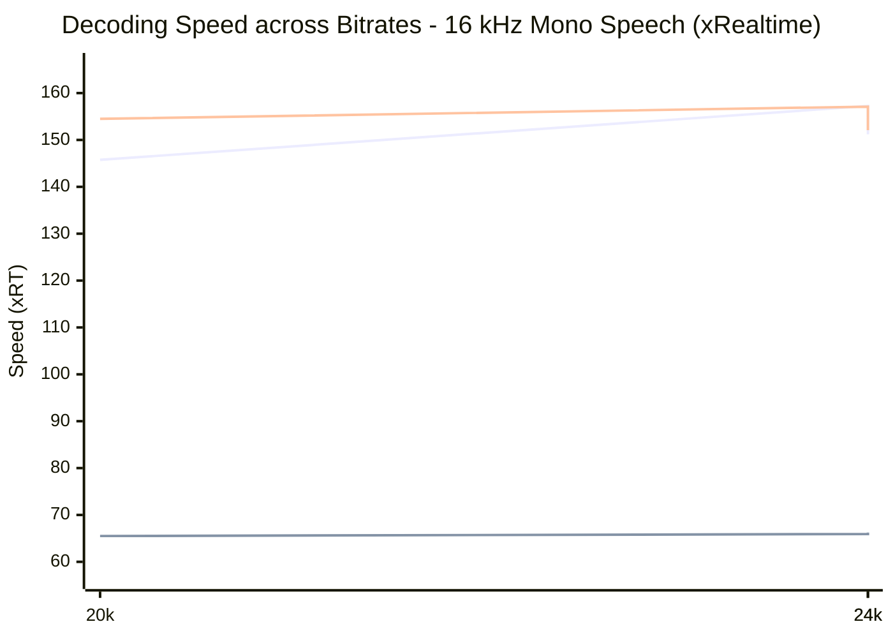
```mermaid
xychart-beta
    title "Decoding Speed across Bitrates - 16 kHz Mono Speech (xRealtime)"
    x-axis ["20k", "24k", "24k"]
    y-axis "Speed (xRT)" 56.34 --> 166.4
    line "FAAD" [145.7517, 157.2537, 151.2004]
    line "FFmpeg AAC 6.1.1-3ubuntu5" [65.5101, 65.9263, 66.2400]
    line "Helix AAC 1.0" [154.5038, 157.1010, 152.0780]
```

###### LC Profile

| Scenario | FAAD | FFmpeg AAC 6.1.1-3ubuntu5 | Helix AAC 1.0 |
| :--- | :---: | :---: | :---: |
