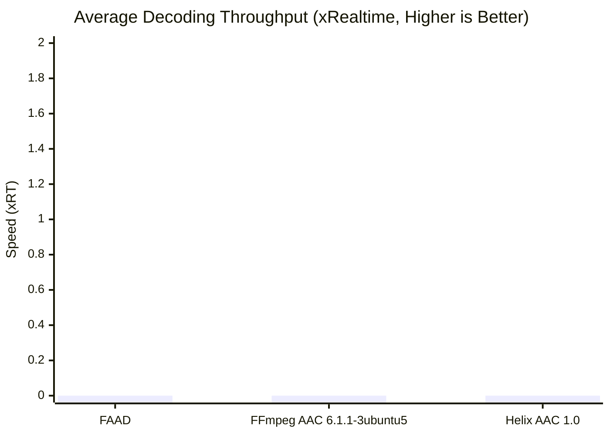

# 🔊 AAC Decoder Leaderboard

[📊 Decoder Rankings](#decoder-leaderboard) | [📋 Decoder Breakdowns](#per-scenario-decoder-breakdowns)

---

## 🔊 Decoder Leaderboard

Objective evaluation of AAC decoders on Spec Conformance (SNR), Decoded Quality (MOS), Timing Alignment Error, Robustness, Speed, and Footprint.

### Overall Decoder Rankings

| Rank | Decoder | Status | Worst MOS | Overall MOS | Mean SNR | Timing Error | Robustness | Speed (xRT) | Peak RAM | ROM (Flash) |
| :--- | :--- | :---: | :---: | :---: | :---: | :---: | :---: | :---: | :---: | :---: |
| 1 | FAAD | ⚠️ (0% valid) | 0.000 | 0.000 | Bit-Exact / N/A | 0.00 ms | **100.0%** | 0.0x | N/A | 113.6 KB |
| 2 | FFmpeg AAC 6.1.1-3ubuntu5 | ⚠️ (0% valid) | 0.000 | 0.000 | Bit-Exact / N/A | 0.00 ms | **100.0%** | 0.0x | N/A | 234.0 KB |
| 3 | Helix AAC 1.0 | ⚠️ (0% valid) | 0.000 | 0.000 | Bit-Exact / N/A | 0.00 ms | **100.0%** | 0.0x | N/A | 120.0 KB |

<b>📊 View Per-Scenario Decoder Breakdowns</b>

### Detailed Per-Scenario Decoder Breakdowns

#### 16 kHz Mono Speech

##### Per-Scenario Average MOS (16 kHz Mono Speech)

##### Spec Conformance (Mean SNR - 16 kHz Mono Speech)

##### Timing Alignment Delay (ms - 16 kHz Mono Speech)

##### Decoding Speed (xRT - 16 kHz Mono Speech)

#### 24 kHz Mono Speech

##### Per-Scenario Average MOS (24 kHz Mono Speech)

##### Spec Conformance (Mean SNR - 24 kHz Mono Speech)

##### Timing Alignment Delay (ms - 24 kHz Mono Speech)

##### Decoding Speed (xRT - 24 kHz Mono Speech)

#### 32 kHz Stereo

##### Per-Scenario Average MOS (32 kHz Stereo)

##### Spec Conformance (Mean SNR - 32 kHz Stereo)

##### Timing Alignment Delay (ms - 32 kHz Stereo)

##### Decoding Speed (xRT - 32 kHz Stereo)

#### 44.1 kHz Stereo

##### Per-Scenario Average MOS (44.1 kHz Stereo)

##### Spec Conformance (Mean SNR - 44.1 kHz Stereo)

##### Timing Alignment Delay (ms - 44.1 kHz Stereo)

##### Decoding Speed (xRT - 44.1 kHz Stereo)

#### 48 kHz Stereo

##### Per-Scenario Average MOS (48 kHz Stereo)

##### Spec Conformance (Mean SNR - 48 kHz Stereo)

##### Timing Alignment Delay (ms - 48 kHz Stereo)

##### Decoding Speed (xRT - 48 kHz Stereo)

#### 44.1 kHz 5.1 Surround

##### Per-Scenario Average MOS (44.1 kHz 5.1 Surround)

##### Spec Conformance (Mean SNR - 44.1 kHz 5.1 Surround)

##### Timing Alignment Delay (ms - 44.1 kHz 5.1 Surround)

##### Decoding Speed (xRT - 44.1 kHz 5.1 Surround)

### Decoder Efficiency & Footprint

#### Decoding Speed (xRT)

