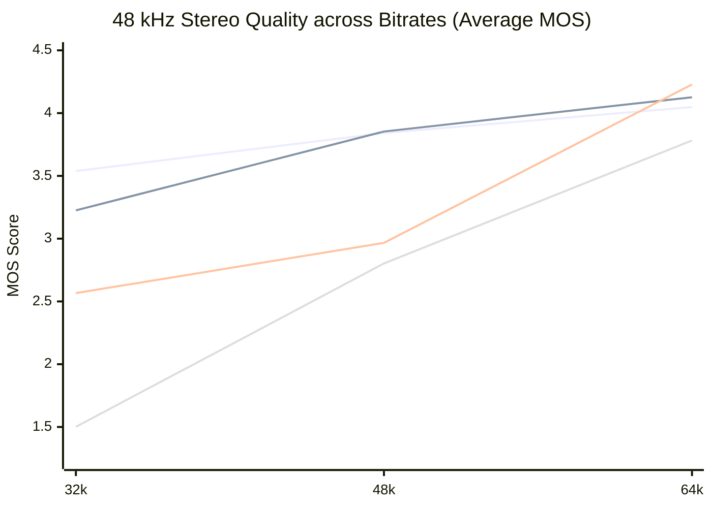
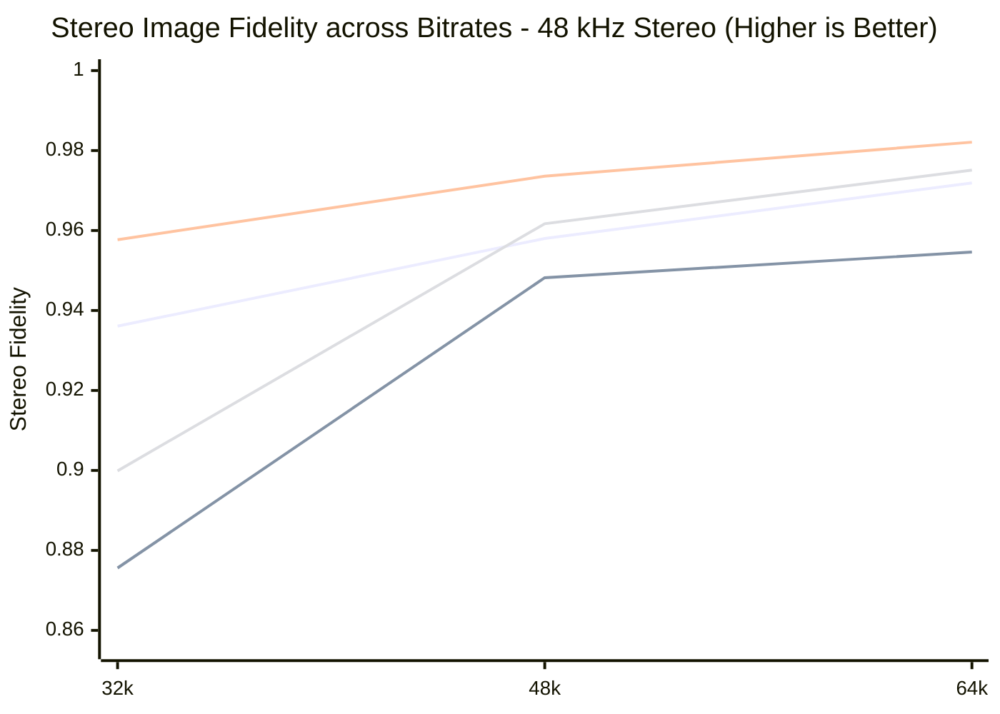
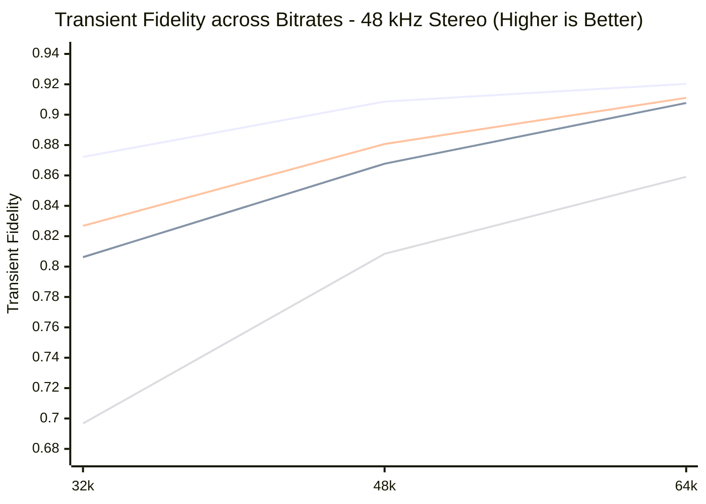
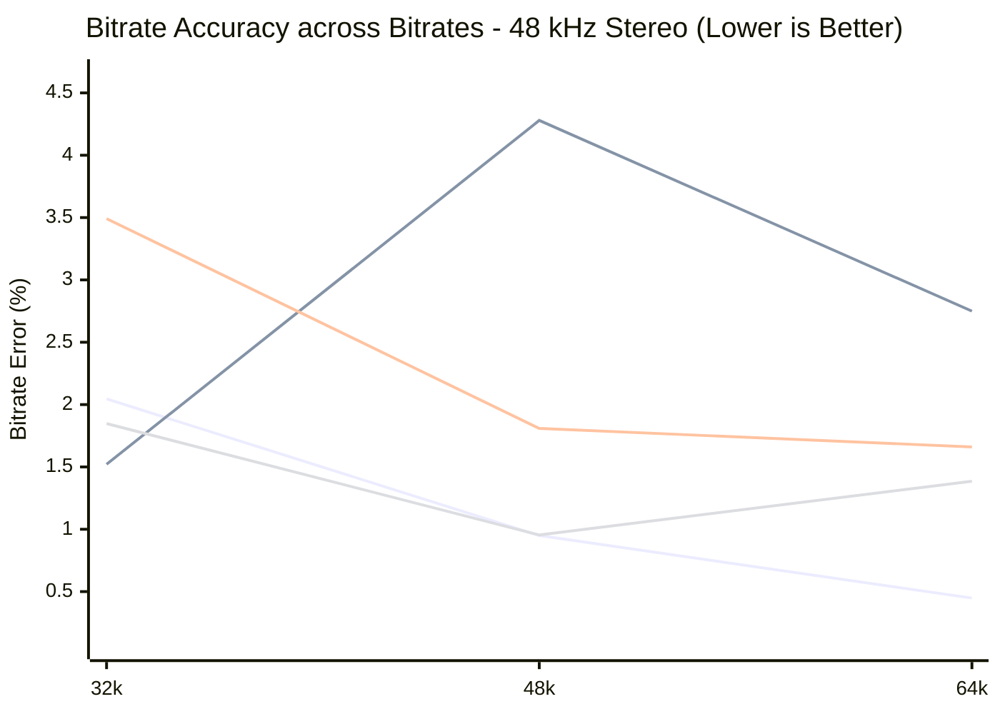
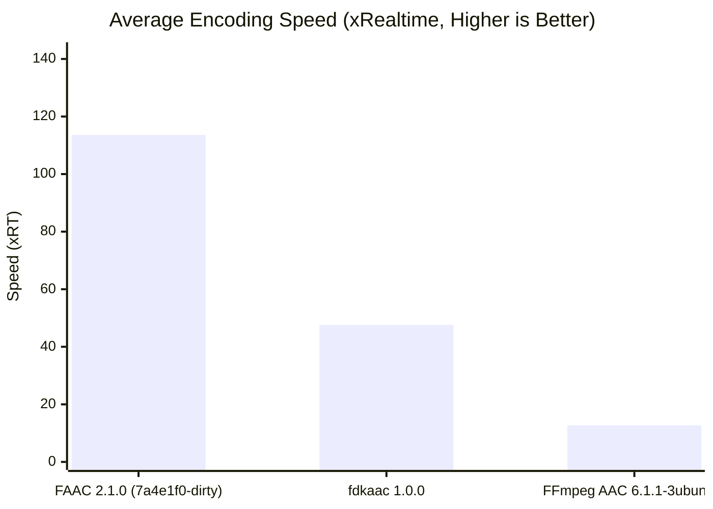
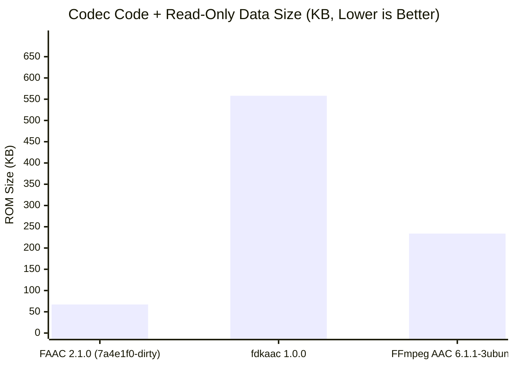

# AAC Encoder Leaderboard

Quality scores are objective proxy estimates (Zimtohrli/ViSQOL), not blind ABX listening test results.

### Overall Encoder Rankings

> **Note**: Overall MOS averages the scenario set listed below, so absolute values are only comparable between leaderboards built from the same set of scenarios. Relative ranking is unaffected.

| Rank | Encoder | Status | Worst MOS | Overall MOS | Scenarios | Stereo Fidelity | Transient Fidelity | Speed (xRT) | Bitrate Error | Peak RAM | ROM (Flash) |
| :--- | :--- | :---: | :---: | :---: | :---: | :---: | :---: | :---: | :---: | :---: | :---: |
| 🏆 1 | FAAC 2.1.0 (7a4e1f0-dirty) | OK | **3.124** | **3.839** | 3/3 | 0.9463 | **0.8822** | **113.6x** | 3.0% | 12.1 MB | 67.2 KB |
| 2 | fdkaac 1.0.0 | OK | 2.080 | 3.254 | 3/3 | **0.9711** | 0.8715 | 47.6x | 2.3% | 12.0 MB | 558.1 KB |
| 3 | FFmpeg AAC 6.1.1-3ubuntu5 | OK | 1.143 | 2.695 | 3/3 | 0.9456 | 0.7820 | 12.7x | **1.4%** | 53.9 MB | 234.0 KB |

<b>📊 View Per-Scenario Breakdowns & Visualizations</b>

## Per-Scenario Breakdown & Visualizations

### 48 kHz Stereo Quality Across Bitrates

<b>View Detailed 48 kHz Stereo Average & Worst MOS Tables</b>

#### Per-Scenario Average MOS (48 kHz Stereo)

#### LC Profile

| Scenario | FAAC 2.1.0 (7a4e1f0-dirty) | fdkaac 1.0.0 | FFmpeg AAC 6.1.1-3ubuntu5 |
| :--- | :---: | :---: | :---: |
| 48k_stereo_32k | _**3.225**_ █████░░░ * | 2.567 ████░░░░ | 1.502 ██░░░░░░ |
| 48k_stereo_48k | **3.853** ██████░░ | 2.966 █████░░░ | 2.803 ████░░░░ |
| 48k_stereo_64k | 4.126 ███████░ | **4.228** ███████░ | 3.782 ██████░░ |

#### HE-v1 Profile

| Scenario | FAAC 2.1.0 (7a4e1f0-dirty) |
| :--- | :---: |
| 48k_stereo_32k | **3.538** ██████░░ |
| 48k_stereo_48k | _**3.842**_ ██████░░ * |
| 48k_stereo_64k | _**4.048**_ ██████░░ * |

#### Per-Scenario Worst MOS (Min Clip MOS - 48 kHz Stereo)

> **Note**: Minimum perceptual MOS score observed across any clip in the scenario. Highlights edge-case clip degradation. A 🐛 names the clip when every other encoder scored ≥0.75 MOS higher on that exact clip -- likely a defect specific to this encoder; see Quality Outliers under Issues Worth Investigating below.

#### LC Profile

| Scenario | FAAC 2.1.0 (7a4e1f0-dirty) | fdkaac 1.0.0 | FFmpeg AAC 6.1.1-3ubuntu5 |
| :--- | :---: | :---: | :---: |
| 48k_stereo_32k | **2.633** ████░░░░ | 2.080 ███░░░░░ | 1.143 ██░░░░░░ 🐛 |
| 48k_stereo_48k | **3.624** ██████░░ | 2.327 ████░░░░ 🐛 | 2.144 ███░░░░░ 🐛 |
| 48k_stereo_64k | **3.973** ██████░░ | 3.729 ██████░░ | 3.241 █████░░░ |

#### HE-v1 Profile

| Scenario | FAAC 2.1.0 (7a4e1f0-dirty) |
| :--- | :---: |
| 48k_stereo_32k | **3.124** █████░░░ |
| 48k_stereo_48k | **3.330** █████░░░ |
| 48k_stereo_64k | **3.480** ██████░░ |

_\* Italicized scores indicate sub-optimal profile performance superseded by another profile from the same encoder at this bitrate._

### Stereo Image Fidelity (48 kHz Stereo)

> **Note**: Measured as 1.0 - |Coherence(Ref) - Coherence(Deg)|. **Higher is truer** (closer to reference stereo image).

<b>View Detailed Stereo Fidelity Table (48 kHz Stereo)</b>

#### LC Profile

| Scenario | FAAC 2.1.0 (7a4e1f0-dirty) | fdkaac 1.0.0 | FFmpeg AAC 6.1.1-3ubuntu5 |
| :--- | :---: | :---: | :---: |
| 48k_stereo_32k | 0.8756 ███████░ | **0.9577** ████████ | 0.8999 ███████░ |
| 48k_stereo_48k | 0.9482 ████████ | **0.9736** ████████ | 0.9617 ████████ |
| 48k_stereo_64k | 0.9546 ████████ | **0.9821** ████████ | 0.9751 ████████ |

#### HE-v1 Profile

| Scenario | FAAC 2.1.0 (7a4e1f0-dirty) |
| :--- | :---: |
| 48k_stereo_32k | **0.9361** ███████░ |
| 48k_stereo_48k | **0.9580** ████████ |
| 48k_stereo_64k | **0.9719** ████████ |

### Transient Fidelity (48 kHz Stereo)

> **Note**: Measured as 1 / (1 + mean |attack-centroid-shift| ms) across onsets. **Higher is truer** (attack timing closer to reference).

<b>View Detailed Transient Fidelity Table (48 kHz Stereo)</b>

#### LC Profile

| Scenario | FAAC 2.1.0 (7a4e1f0-dirty) | fdkaac 1.0.0 | FFmpeg AAC 6.1.1-3ubuntu5 |
| :--- | :---: | :---: | :---: |
| 48k_stereo_32k | 0.8062 ██████░░ | **0.8268** ███████░ | 0.6967 ██████░░ |
| 48k_stereo_48k | 0.8677 ███████░ | **0.8807** ███████░ | 0.8084 ██████░░ |
| 48k_stereo_64k | 0.9077 ███████░ | **0.9111** ███████░ | 0.8591 ███████░ |

#### HE-v1 Profile

| Scenario | FAAC 2.1.0 (7a4e1f0-dirty) |
| :--- | :---: |
| 48k_stereo_32k | **0.8722** ███████░ |
| 48k_stereo_48k | **0.9086** ███████░ |
| 48k_stereo_64k | **0.9203** ███████░ |

### Bitrate Accuracy (48 kHz Stereo)

> **Note**: Deviation from target bitrate calculated from pure elementary stream audio bytes. **Lower is Better**.

<b>View Detailed Bitrate Accuracy Table (48 kHz Stereo)</b>

#### LC Profile

| Scenario | FAAC 2.1.0 (7a4e1f0-dirty) | fdkaac 1.0.0 | FFmpeg AAC 6.1.1-3ubuntu5 |
| :--- | :---: | :---: | :---: |
| 48k_stereo_32k | **1.5%** | 3.5% | 1.8% |
| 48k_stereo_48k | 4.3% | 1.8% | **1.0%** |
| 48k_stereo_64k | 2.7% | 1.7% | **1.4%** |

#### HE-v1 Profile

| Scenario | FAAC 2.1.0 (7a4e1f0-dirty) |
| :--- | :---: |
| 48k_stereo_32k | **2.0%** |
| 48k_stereo_48k | **0.9%** |
| 48k_stereo_64k | **0.4%** |

### BD-Rate Relative Efficiency (vs FAAC 2.1.0 (7a4e1f0-dirty))

> **Note**: Bjontegaard-delta rate (BD-rate) measures the average percentage difference in bitrate for equal perceptual quality (MOS). **Negative % = candidate is more efficient** (uses fewer bits for same quality). BD-rate holds quality fixed by construction, avoiding bitrate-bias traps of raw fixed-rate MOS deltas.

| Encoder | Profile | BD-Rate % vs Baseline |
| :--- | :---: | :---: |
| fdkaac 1.0.0 | LC | +54.34% |
| FFmpeg AAC 6.1.1-3ubuntu5 | LC | +50.28% |

### Encoder Efficiency & Footprint

#### Encoding Speed (xRT)

#### Codec ROM (Flash) Size

<b>View Detailed Per-Scenario Efficiency Table</b>

#### LC Profile

| Scenario | FAAC 2.1.0 (7a4e1f0-dirty) | fdkaac 1.0.0 | FFmpeg AAC 6.1.1-3ubuntu5 |
| :--- | :---: | :---: | :---: |
| 48k_stereo_32k | **83.4x** █████░░░ | 55.3x ████░░░░ | 13.2x █░░░░░░░ |
| 48k_stereo_48k | **125.5x** ████████ | 45.7x ███░░░░░ | 12.8x █░░░░░░░ |
| 48k_stereo_64k | **123.7x** ████████ | 41.9x ███░░░░░ | 12.2x █░░░░░░░ |

#### HE-v1 Profile

| Scenario | FAAC 2.1.0 (7a4e1f0-dirty) |
| :--- | :---: |
| 48k_stereo_32k | **91.7x** ███████░ |
| 48k_stereo_48k | **108.7x** ████████ |
| 48k_stereo_64k | **109.4x** ████████ |

<b>🐛 View Quality Outliers (Issues Worth Investigating)</b>

### Quality Outliers (Issues Worth Investigating)

> **Note**: Flags clips where this encoder scored **≥0.75 MOS lower** than the average of all other encoders on the exact same clip. These clips represent isolated codec defects, killer clips, or tuning bugs.

| Encoder | Profile | Scenario | Outlier Clip | Encoder MOS | Peer Avg MOS | Defect Gap |
| :--- | :---: | :--- | :--- | :---: | :---: | :---: |
| FFmpeg AAC 6.1.1-3ubuntu5 | LC | 48k_stereo_32k | `velvet.16b48k.wav` | 1.14 | 2.87 | **-1.73 MOS** |
| FFmpeg AAC 6.1.1-3ubuntu5 | LC | 48k_stereo_48k | `velvet.16b48k.wav` | 2.14 | 3.16 | **-1.01 MOS** |
| fdkaac 1.0.0 | LC | 48k_stereo_48k | `velvet.16b48k.wav` | 2.33 | 3.10 | **-0.77 MOS** |

---
**Metric Legend**:
- **Ranking**: by Worst MOS, then Overall MOS as tiebreaker.
- **Quality (MOS)**: Perceptual audio quality (1-5, **Higher is Better**)
- **Stereo Fidelity**: Faithfulness of stereo image (0-1, **Higher is Better**)
- **Transient Fidelity**: How little attacks are smeared/delayed (0-1, **Higher is Better**)
- **Speed**: Encoding throughput (**Higher is Better**)
- **Bitrate Error**: Deviation from target bitrate (**Lower is Better**)
- **ROM (Flash)**: Codec code + read-only data size (**Lower is Better**)
